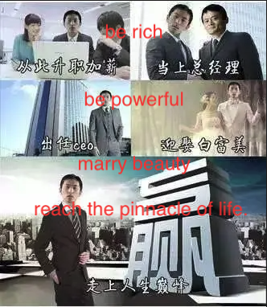
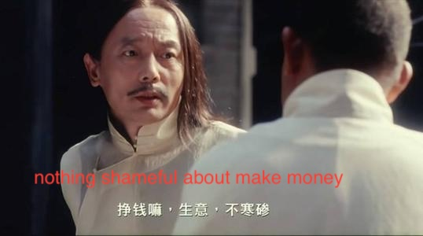
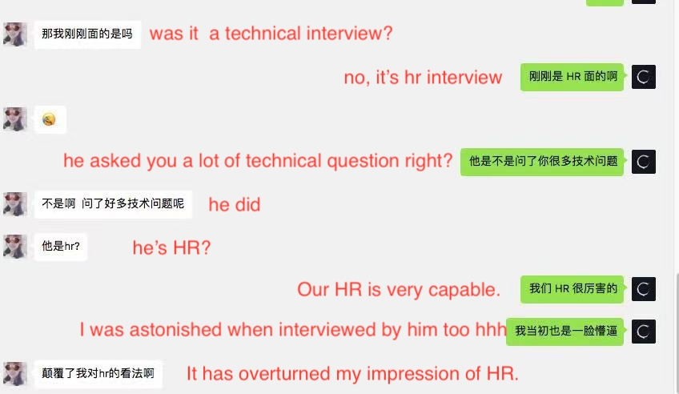
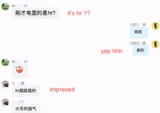
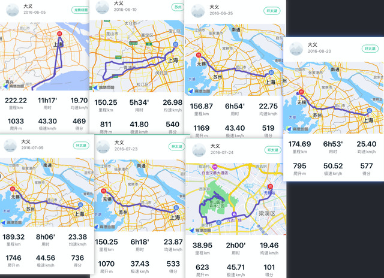
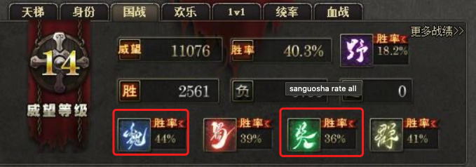
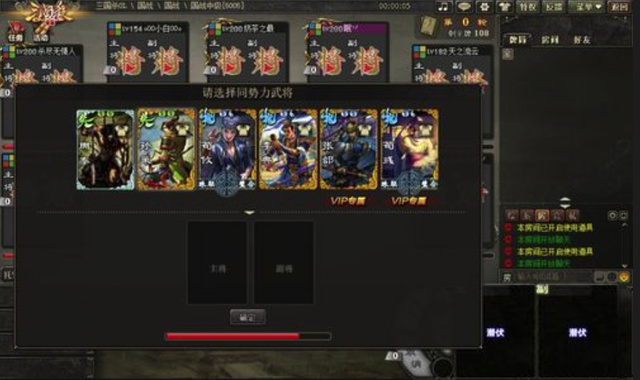
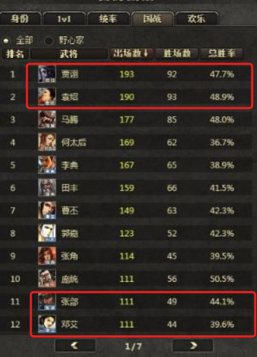
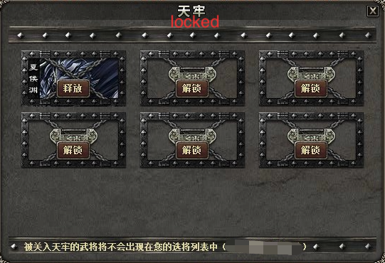

It's undoubtedly fortunate to choose the industry you like when first start your career, but not everyone can do this. The first reaction I often hear from people learning about my experience is "What the fuck?!". Let's talk about the story today. 😁

### Starting career.

I was born in an ordinary village in the northeast, dutifully attended school and university. Mom always told me: "Once you go to university, you'll be emancipated~" So after a four years of carefree fun, I graduated.

Most of the teenagers who just graduated in China want to get rid of the economic dependence on their parents as soon as possible and live their own little life, and I am no exception. I had no other ideas, so making quick money became the only idea.

I heard that there is a profession called headhunter. Daily either suited and booted, exploring industry trends with bigwigs, talking about business planning, career planning; or like a secret agent, using various methods to find the target candidate, and persuade and debate to join the client company, and the income is not bad. Sounds great, right?
So I joined a headhunting company. I thought my life would be like this:

Taking orders, finding candidates, interviewing, offering jobs, and onboarding. Work is carried out in an orderly manner, and some scenes appear from time to time:

- For two positions with similar commissions, one is very important but difficult to do, while the other is easy. How to choose?

> _Absolutely do the easy one and get the money first, the difficult one can be done later._

- Customer X thinks the candidate is capable, but the salary expectations are too high. What should I do?

> _To the customer: "The candidate is excellent and highly sought after in the market. Company Y offered him an annual package much more than us. We should try to compete as much as possible. I will also delve deeper to understand his thoughts, to see if we can possibly get him to accept our offer."_  

> _To the candidate: "The salary provided by Company X is among the top in the same level, and their internal promotion is very fast. Although Company Y offers a bit more, their internal promotion and salary increase are quite slow. Both X and Y have their advantages... Of course, I will further negotiate for you. Besides the salary, I will see how much room there is for negotiations regarding subsidies, stock options etc..."_

- The candidate has received an offer from client Company X, but also has an offer from Company Y. What would you do?
- Would your approach be different if Y was also your client and this offer was considered as part of your performance?
- ......

After doing this for a while, it becomes clear that the core of a headhunter's job is to **Get Payments**. Exploring industry trends, career planning, all are services for this purpose.

- You know that some companies are a bad choice but they offer high commissions. Would you work on their vacancies?
- To be fair, you also believe that the candidate's other offers are better than the client's, but would you still try to convince the candidate to join the client?
- Some candidates regret shortly after joining, but as long as they pass the 3-month probation period, you can get the full payment. Would you persuade them to observe more?
- ......

**But it feels really bad.**

I've taken a serious look back at my work over the past year and found that apart from making a profit, there were few moments of enjoyment. Moreover, disregarding economic value, I'm skeptical of how much social value I truly produce. Is this what work is all about? I'm not sure. But **I do not want my work to be like this**.

### Exploring direction.

A headhunter considering a career change would naturally first think of recruiter. More than a year of headhunting had given me basic recruitment skills. In March 2016, I joined Gllue Software.

No longer did I have to understand different industries and clients every day; I just needed to focus on my own industry and company. No longer did I have to do things against my will for the sake of commission. Each interviewee was a potential colleague, making communication more sincere and comfortable. No longer did I have to urge clients for feedback after each interview, constantly weighing up its authenticity. I could directly discuss the pros and cons with the interviewer and make adjustments. More sincerity and less trickery. Work was no longer a awkward thing.

At the time, recruitment was mainly for R&D. The R&D team was less than 10 people, and technical interviews often took a long time. A day of interviewing for an engineer basically left no time to do anything else, and candidates often failed the technical interview. It was clear to see that R&D team was inputting a lot of time, but the output was very low.

Although R&D team understood and accepted this situation, I still wanted to improve it as much as possible.

Change direction? Can you guarantee that the adjusted direction will definitely be correct? And the time cost is certainly not low.

Raise the resume standard? Please, it's already difficult for a small company to recruit. Doing this would only miss some potential excellent candidates.

So, what to do?

The solution was simple. I decided to adopt the same approach as the R&D team.

I gathered questions that the technical staff often asked, and sat in on some interviews to observe their interviewing and decision-making processes. Then, I tried conducting the technical interviews myself. For more details, you can check out this article ["How HR in Start-ups Can Quickly Recruit R&D Elites"](https://mp.weixin.qq.com/s/ukxm8wxqcZ-YTRmr2QSo0Q).

The results were quite good, the interview pass rate increased significantly. Additionally, interviewers found it quite fascinating, thinking that the technical atmosphere here must be excellent (even HR conducts technical interviews 😳). Many candidates were willing to recommend their classmates and friends to give it a try.

Although the company didn't have any brand recognition or significant market presence, recruitment still went smoothly.

 

 Subjectively, when you taste success in something, you naturally want to devote more time to it. Objectively, the screening effect of simple questions is diminishing (some smart candidates who have been internally referred have prepared for the "interview questions" in advance 😓).

So I no longer constrained myself to simple convergence problems, but began to learn more about technology, expanding my "question bank", and even making some demo projects for fun.

At the same time, I also read some books, such as "The Fifth Discipline", "Rework", "How Google Works" and so on. Why did I read these? Because these were the books available on the company's bookshelves 🙄. They might not all be goldmines of information, but continuous learning is always a good thing.
I also attended some industry conferences organized by investors for their portfolio companies, and got to know and learn from some seniors in the HR field.

All in all, 2016 was a fulfilling and pleasant year.

In 2017, as the business grew, the company gradually opened up positions for product, design, customer success, sales, finance, etc., and also let me take over HR duties like employee relations and benefits.

I've always been interested in new things, but I quickly lost interest this time. Routine tasks like implementing attendance policies, calculating salaries, managing employee relations, and organizing team-building activities felt boring and even a waste of my time. I'd rather spend the time reading, learning technology, or recruiting.

At this point, I had been working for nearly three years. I carefully analyzed my thoughts and circumstances, and penned an article [ "What Young People Should Consider When Choosing a Career"](/blog/career-consider-for-young).

I realized that when I first graduated, my primary desire was to make money, which led me to the headhunting industry.

However, after working for a year, I found that a life revolving around money wasn't fulfilling. Deep down, I wanted to do something genuinely meaningful. Therefore, during the early stages of my recruit work, I was delighted to see the tangible social value my work produced.

The situation is different now, I want to create greater, more lasting value in a way that I enjoy. Clearly, routine HR tasks aren't what I enjoy.

In the words of Mao Zedong, **the primary contradiction is constantly changing**.

Do I have a passion for the HR profession itself? Not really, what I truly enjoy is the tangible process of producing social value 🤨.

As long as I'm in this field, I must continue to improve myself, whether in breadth, depth, or (to add one more thing), height.

**But if I do not enjoy the work itself and only learn and grow for the sake of "career development," how far can I go? Even if I can go far, wouldn't such a career feel boring and regrettable?**

The essence of my role in tech interviews is taking on the work of R&D. Since I enjoy the process of producing value, why not become a direct producer (developer) myself?

Wait, are you sure you're not considering a career change because developer has a relatively high average salary? This is an objective fact, and it's hard for me to deny that it doesn't influence me.

So I asked myself, "If I were given the chance to switch to developer without a raise, would I?" The answer was affirmative.

I went a step further: "What if I had to take a pay cut?" After only a brief contemplation, the answer was still yes.

> _I often use this method now. For example, if an app charges $10 for a monthly membership and $80 for an annual membership, would I buy the annual membership? I would ask myself: If the annual membership was $130, would I still buy it? If yes, then I would directly buy the annual membership; if no, even if there was a greater discount, I would only buy the monthly membership. In this way, I can ensure that my choice comes from my heart, not as a result of the merchant's persuasion._

### Take the first step

After determining the true answer in my heart, I plucked up the courage to resign. Everyone admired my bravery and resolve, wishing me smooth sailing. I sequestered myself at home and studied hard for 3 months. When I emerged, I was overwhelmed with job offers from every direction. Big corporations were begging me to join their senior management, and "unicorns" were insisting that I join them as a partner.

---

Sorry for walked into the wrong movie set just now... hhh

Although I want to say that I am "resolute and decisive", I immediately switch careers and quickly embark on a new professional career, but the fact is not the case.

I know I should act decisively, but I didn't. I've looked at so many resumes, and I understand that the first impression of a career switch is often negative. Moreover, it's too bizarre for an recruiter to switch to developer - I've seen a lot of developer switching to product, sales, or recruitment, but how often is it the other way around? Should I take this step? Can I make it?

So I was torn, working on one side and learning things in bits and pieces on the other. The result of trying to juggle both was that I could handle neither - I didn't accumulate much in terms of technical skills, and my work performance was mediocre. One day, I was flipping through my diary and was shocked to find that I had been struggling for almost a year. 

**I suddenly realized that I had wasted a year like this.** Wasting your time in hesitation is undoubtedly one of the most foolish actions.

The fact is clear, if I don't decide now, I will still be struggling about whether to transform in the future. It's time to put an end to this.

There's still one thing I need to confirm: Can I calm down and be an recruiter? Don't forget that I've always been a self-made professional. Would it be better if there was a more capable leader to guide me in applying excellent methodologies?
I got in touch with some big companies and realized that a good leader could help me grow, but they could not solve my interest in my career.

The fact is becoming clearer. I will not be content unless I try to get involved in developer. Taking this step, I might regret it, but if I don't take this step, I will surely regret it.

Well, let's do it 🔥

I wouldn't have enough time to learn if keep staying at Gllue, time to leave.

### Stumbling forward.

Studying on my own can easily disconnects me from society, so I decided to do "half work, half study".

At the end of May 2018, I joined Zilliz for several reasons:

- Zilliz at this time was similar to Gllue in early 2016, few employees, my work is mainly recruiting R&D
- I expressed that I did not want to get involved in the other parts of HR besides R&D recruitment, and this was agreed upon;
- Despite the small team, everyone was a technical expert.

The familiar environment and simplest tasks ensured that I could complete my work in the shortest time, and the rest of the time could be used for learning.

Almost four months went by without me noticing. One day, Charles (the founder of Zilliz) told me that the company had made an offer to a HR Director named M, and M would join the company soon.

I immediately realized that I could no longer "learn in secret". When M joins, it is inevitable that a series of tasks will be carried out, and I cannot be exempted.
After only half an hour of considering, I decided to tell Charles about my wish to switch to the R&D department.

Frankly speaking, I didn't have high expectations for this conversation. Although I don't think it's smart to quit without another job lined up, since "half work, half study" seemed unfeasible, I didn't mind trying this route. Despite only having experience in self-practice projects, I was still prepared to apply for some R&D positions directly. I even prepared to talk to Gllue to explore the possibility of returning as a developer.

Surprisingly, when Charles heard my thoughts, he was a bit surprised, but agreed without even considering it further. The company's website was about to be revised, and he asked me to assist with the revision while helping M with recruitment. After the front-end leader arrived, I would fully switch to a developer.

Surprised and a little relieved. I wrote the following in my diary that night:

> _The internal transfer seems smooth, but there are still many things that are hard to say. Now I'm doing more recruitment oriented work, and from my own perspective, I feel like I'm wasting my time.But internal transfer is also a rare opportunity.Should I go out and try? After all, I have never had a formal interview with other companies. At present, I do understand some things about the implementation of the source code in theory, but I am very lacking in practical application. The time I have invested is still not enough. Anyway, since I have chosen a direction, let's just keep running forward, don't think too much, I know what I want. And what's more interesting is: I don't need to be successful all the time, as long as I succeed once, it's enough. Zilliz may be an opportunity —— 2018-09-13_

In January 2019, a senior front-end developer B joined the company, I was so happy because finally there was a guru to work on the project with me.

Unfortunately, he was fired one and a half months later. 😓

In April 2019, J joined. Following J, I started to work on my first commercial project — the Infinity big data visualization platform.

The methods of debugging, the basic ideas of the project, the way to read source code... I continually learned from him. The scattered knowledge points in my mind gradually connected into a line, then into a network, during the project iterations and my own learning reflection. Various concepts and patterns were no longer just text in my mind, they gradually became real cognition.

Even though the workload was heavy, I was very happy during that period, as I could see my progress every day. I felt that I was finally "on track".

This status lasted for more than three months. I knew I was still making progress, but the rate of progress was noticeably slowing down.

I knew that a big reason for the rapid progress before was that my foundation was too poor. Just like when China's economic volume was low, it could maintain double-digit growth every year, but that's not a permanently sustainable state.

I spoke with Charles about my feelings, and Charles said J has a good evaluation of me, take it slow, don't rush.

I understand. Technology development requires a steady step-by-step accumulation, I shouldn't be in a hurry.

But how could I not be in a hurry? Compared to my peers, I am at least four years behind. I still want to accumulate and progress faster, I just need to find a solution.

### Speed up and move forward.

I've always wanted to build a "tree hole" website, so I decided to start from that.

Treat myself as the core user, think about the requirements, set the schedule. I worked enthusiastically for a few months. Although it didn't go live in the end, I still learned a lot. Not just in terms of technology, but also about products and commercialization.

In early 2020, considering the scale and development stage of the company, I felt that what I could do and had exposure to was still quite limited, so I decided to go out and take a look.

My goals are clear:
- To know what outside front-end developers are doing;
- To know my weaknesses and clarify the direction I need to work for in the next three months;
- To know the market conditions.

I have no idea what the outside is like. So I decided to prepare for the worst.

From my recruitment experience, I know that companies generally restrict candidates who failed the interview from applying for similar positions within six months. What if I want to try again within six months while the interview did not go well?

A light bulb went off in my head, and I decided to create a "shadow" resume.

As Gllue's main product is recruiting management system, I have a clear understanding of how to check for duplicate resumes. Soon, a completely "anonymized" resume containing my name, cellphone number, email, education, work experience was ready. If the interview was successful, it would be no problem for me to use the real resume afterwards; If I failed, it would not affect me applying again in the future.

I admit that was kind of shameless 😅, but I indeed benefited a lot from it. After interviewing with more than ten companies, I fulfilled all three goals, and even got some unexpected gains.

However, considering that I was using a shadow identity, and I was likely to leave Shanghai for Beijing, so I turned down all the interviews.

### Unexpected discovery.

**When you see a line, it's just a line. But when you see another line intersecting it, what you see is not two lines, but a whole plane.**

After the interviews, I conducted a systematic review of the company's projects, my own projects, and my growth process.

The more I pondered through this process, the more familiar it seemed. At one moment, I realized that this is a freaking live version of "history" 🤦🏻

In the first three months when J led me, the technical knowledge in my head connected into a web. Now this web has started to integrate my understanding of recruitment, history, engineering, philosophy and other fields.

This process was even faster than I imagined, just like when you suddenly discover gravity, and then find that it is omnipresent. I saw countless patterns and the things behind them.

**The world in my eyes is no longer the world as I used to perceive it.**

Many things become easier to understand, and while the manifestations of many problems in different fields may be different, the fundamental reasons are similar. Therefore, solutions from different fields can refer to or cross-verify each other.

I looked at engineering from the perspective of history, analyzing the development of philosophy through engineering methods, the more I see, the more interesting I found.

This feeling is like trying to explain the orbits of celestial bodies with the "geocentric" theory, the more explanations you give, the more messy and complex it gets. But when you look at it from the perspective of "heliocentrism", wow! Things are so simple!

J asked me to read the Kibana source code, what I saw was not its code, but its development "story". When I saw that its author had stepped on the same pitfalls as me, I couldn't help but laugh.

I no longer obsess over the speed of my progress, knowing I'm on the right path. Although the road is long and the journey far, there's joy in every step forward ~

I'm also no longer anxious about technology developing too fast or about there being too many technology stacks. As my understanding of their essence deepens, I find an increasing sense of inner peace.

The books I've read, the things I've done, each time I rethink them, they have a different flavor. I don't spend a lot of time browsing technical forums anymore, I think I've found a learning method that suits me better.

I feel like I'm in a new wilderness area. The next thing to do is to observe, experience, explore, accumulate, keep outputting, and wait for the next explosion. For some strange reason, I have a premonition that the next explosion won't be far off.

### Looking back

Looking back at my past, some experiences played very important roles. I'll talk about them separately.

#### "Near-death" experience

In 2015, I went to the Thousand Islands Lake with my buddies. After checking in, a group of us found a suitable spot and began to play in the lake.

The sun was bright, the temperature was right. Those good at swimming swam towards the opposite bank, and others just had fun by the shore or on kayaks. I was listening to their banter, eyes closed, just randomly floating on the water surface (could there be any more stupid behavior than this?). When I opened my eyes, I found myself far from the shore (I can't remember the exact distance, but at first glance, it seemed most likely that I couldn't swim back).

I tried to swim back, but the wind started to blow away from the shore. I felt like I was moving backward for every meter I tried to swim forward. I yell for my friends in the kayak to help me, but after a few shouts, I realized they obviously couldn't hear me. I didn't know how deep the lake was beneath my feet, but it was more than enough to drown me...

holy shit!!!😱😱😱

The moment I realized my life might truly be in jeopardy, my heart rate shot up immediately, my muscles stiffened, and calves started to cramp slightly.

I didn't know what to do, but I knew that if I didn't calm down, I'd be in real trouble within two minutes...

I forced myself to take a few slow, deep breaths, and then had a conversation with myself: Don't panic! I've been floating on the water, which hasn't taken much energy. The lake is calm, the water isn't cold. I'm absolutely safe for at least 20 minutes.

I knew I was right. My brain cooled slightly. My heart was still beating rapidly, but it was gradually stabilizing.

I still needed to figure out how to get to shore.

I wasn't wearing a brightly colored life vest; yelling was obviously useless; given the size of the lake and the distance, they probably couldn't see me waving my arms. I couldn't rely on them. I had to rely on myself.

I turned around in the water to observe the situation around me:

- Swimming back would be against the wind and a long distance. I could easily run out of energy. It was too risky.
- Swimming to the small island on the opposite side would be with the wind, but the distance was even longer and the situation was unknown. That was even riskier.
- I couldn't even see the shore on my left hand side, so that option was out.
- On my right hand, following the shore wouldn't require swimming against the wind, and it was no further than swimming back. Plus, there were aquatic plants along the shore, so the water there was probably shallow. That option looked the best!

This might seem like a lot of words, but in reality it only took a few seconds to observe and make a judgement at that time.

It seems simple, but under the tense mood at that time, it was not easy to observe, think, and judge calmly.

Fortunately, despite being badly bitten by small insects in the water grass, I still managed to save my own life. After crawling ashore, my legs weakened and I had a wave of fear.

This experience gave me an important skill: in necessary moments, I can suppress my emotions and let rationality forcefully take over everything.

Because of rationality, I can be realistic. This is particularly important when making important decisions.

Whenever I need to seriously think about something, I can ensure I won't deceive myself. The answer I give to myself guarantees the most authentic thoughts in my heart. If it's contrary, it is contrary; if I like it, it is so; if I'm not interested, I just don't. 

Based on reality, I can make a better judgment of my circumstances, and then make the choices that are more suitable for me.

#### Cycling

I've always been a fan of cycling. In elementary school, I roamed all around my neighborhood on a bike; after my college entrance exams, I rode all over the city I lived and its surroundings with my first road bike; during university, I basically biked all over Shanghai; and after graduating, I accidentally joined "Start Cycling Club", participating in organized activities (like circling Tai Lake, or the Ma Zi ride [a non-stop 421km ride within 24 hours]), as well as individual trips (like going north to Nanjing, or south to Yangzhou), so I've basically visited all the cities around Shanghai by bike.

Cycling has made me realize: **If you like doing something, you'll naturally do it often.**

The Tokyo Olympic women's cycling road race champion, Anna, became popular this year. People found her behavior of setting up her own training plan, studying body temperature responses, and investigating road conditions interesting, but it felt familiar to me. Because when I was preparing for the Sichuan-Tibet route in 2016, I did similar things.

In the half-year preparation period, I would ride long distances about every weeks to boost my fitness. The distance from Shanghai to Wuxi is the most appropriate (150km), and aside from that, there's a roughly 300-meter-high Hui Mountain, convenient for uphill training, so this route is the one I rode the most.

Every time, I would deliberately control my heart rate and cadence while exercising, and then analyze:

- The physical energy expenditure at different heart rates;
- The most comfortable and sustainable cadence;
- How often I need to supplement carbohydrates to maintain stable blood sugar;
- Whether the current bottleneck is cardiorespiratory function or muscle endurance, and enhance - accordingly (for this, I did the Insanity workout, a high-intensity fitness routine, for over a month)
- ...

Based on my own test data, I set up a plan to complete the Sichuan-Tibet route(two thousands kilometer) in 13 days. It sounds crazy, but I know it's highly feasible.

The point of telling you all of this is not to brag about how strong I am (okay, I do want to boast a bit), the point is that I've realized: when you do something out of love, you naturally want to do it better. You won’t find efforts for it tiring, instead, you'll enjoy it.

Regrettably, I didn't accomplish my plan that year. I fell down on the way down Erlang Mountain, and scraped off a large patch of skin from my left knee and thigh. However, since my muscles and bones were not substantively damaged, I continued according to plan.

But the continuous cycling prevented the wounds from scabbing over properly; at the end of each day's ride, I'd have a large patch of exudate stuck to my cycling pants.

Despite the normal progress and my physical condition being fine, I gave serious thought to it (what if I get infected, especially in the plateau area), and decided that it would be safer to give up. So I abandoned the trip just before Litang. I felt deeply regretful at the time, as this was, you could say, the thing I had prepared most heartily for since starting college. I do cried for a long time...

Even though I regretted it, on the way back to Chengdu, I noticed a lot of the scenery that I hadn't paid attention to on the way there (for I had been focusing on making time, every day was just head-down cycling). Looking back on this experience later, even though there is some regret, it still feels wonderful. I realized that doing what your heart loves, no matter the outcome, will become beautiful memories in life. (Of course, I'll be back to the Sichuan-Tibet route again 🤓 )

For me, knowing my state while cycling made me aware that there was much room for improvement in my work state. This further led me to reflect and compare, and finally take the first step.

You too, can think about whether there's something that you've prepared for earnestly, done joyfully, and remember fondly, and do not feel it was a waste of time or a cause of loneliness or boredom. If there is, you might want to try applying that state to other parts of your life, it might greatly improve your life; if not, then keep trying and searching, you're sure to find it.

#### SanGuoSha(A card game based on the ancient Chinese historical event)

I started playing since college, especially fond of the "National War" mode, the more I liked it, the more I wanted to play well, and the win rate was obviously the clearest indicator.

I met "AfricanDaddy" in the game, this guy's win rate was as high as 44% (top 10 in the game!!!)

I began to observe and imitate his gameplay, and quickly learned the essence of national warfare. My win rate also began to steadily improve. It is not difficult for me to conclude: **imitation is a very effective way to learn.**

Each game is a "precious" source of experience:
- Which general combinations are more balanced on offense and defense, which combinations are suitable for solo, and which are suitable for launching a team battle...
- What if the enemy is a master, what if a teammate is a rookie...
- When should I grow sneakily, when should I boldly come out to launch a team fight, how should the endgame be balanced...

Looking back, it's quite amusing, it was in the game that I understood what "old soldiers know that there are no constant tactics, as water has no constant shape. Those who can win by adapting to the enemy's changes are called gods." 🤷

If you already have a very deep understanding of the game, can you further improve?

**There are always more solutions than difficulties.**

Let's say if the following is your statistical data, the combat results of Wei Country(the blue one) are obviously better than Wu Country(the green one).

At this point, isn't Wei Country a better choice?

Suppose the following is your win rate with different generals.

Despite the overall better win rate of Wei Country, compared to bottom couple(Wei), is the top couple(Qun country) a better choice?

Can we go further?

Since the appearance of the cards is random, can we disable the cards with low win rates to increase the possibility of high win-rate generals appearing?

......

Gradually, I became a "master" with a win rate of 42.9%.

> _If I had used this kind of mentality to seriously think about the future during my university years...🤦🏻 Alas, it's never too late to start_

The attitude towards games is also affecting my attitude towards life.

- At the start of the game, the cards you can choose from are randomly assigned, and sometimes your combination is just weak;
- Some people, with no rationale, suddenly open fire on you;
- Despite a match being practically decided, some teammates insist on taking unnecessary risks, leading to an overturned result;
- "Is winning what makes playing a game fun?"
- "If the winning rate is so high, it must be rigged"
...

But I just enjoy the process of earnestly improving my win rate ╮（╯＿╰）╭

So, no matter how the starting line-up is, what the state of battle is, or what others say, I will always play the game seriously according to my own thoughts.

I've gradually developed a habit: **when I want to do something, I won't be influenced by factors beyond my control; I will only do my best on what I can do, what I can influence.**

#### Continuous reading and thinking.

I have always had a habit of reading. Once you read a lot, you will make some interesting discoveries:

> _I suddenly found that the process of reading and digestion is quite similar.You eat a piece of protein, break it down into amino acids, and then combine it into your protein, which then becomes your flesh and blood. Take an article, break it down into different viewpoints, sentences, and words, and then reassemble it into new words, it becomes your thought, and also becomes your own thing. —— 2017-04-08_

Just as there are good and bad foods, the same is true for books.

Reading a good book is like planting a seed in your mind, which blooms into a flower in your mind with the passage of time, when you least expect it.

This is like the "unexpected discovery" I mentioned earlier.

### Postscript

Now and future, many people will still experience confusion about their careers, reflections about themselves, and apprehension about embarking on new paths. My thoughts and actions are certainly not the standard answer, but at least they are a real and effective "reference answer."

Honestly, I also struggled a few times when I started writing. Why should I write so authentically? Isn't it better to describe myself as a person who burns his bridges and successfully transitions to a "big shot"?

>_I hate the empty language of success-study people, I wanted to record my daily thoughts. So when I am successful in the future, and the juniors come to ask me about my experience, this diary will tell them the most real method and the reasons for success. ——2014-01-12_

Just consider it as a gift to my past self. 😜

I will continue to output in the future, and welcome contributions and comments from everyone.

I would like to suggest once again that everyone read the ['Personal Development for Smart People'](/blog/translation/pdfsp/summary). Hope everyone can live a conscious life.

