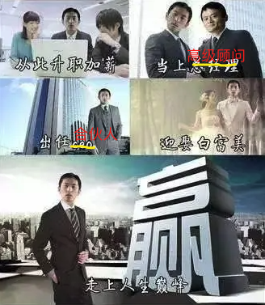
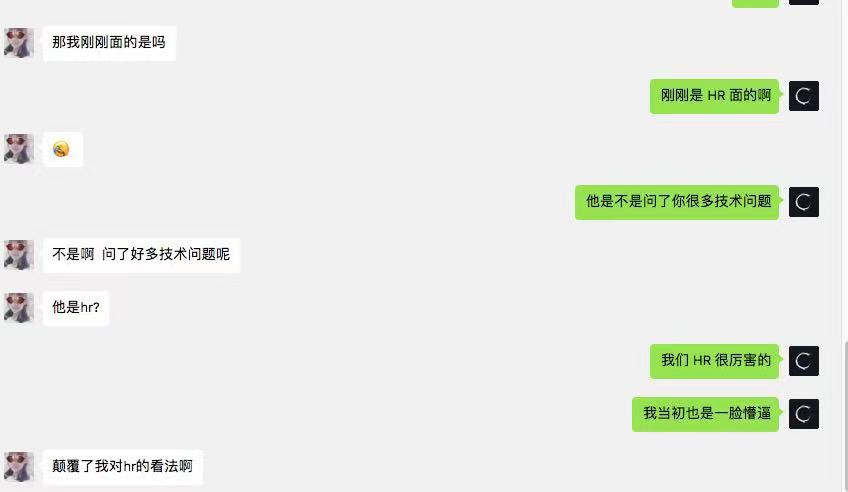
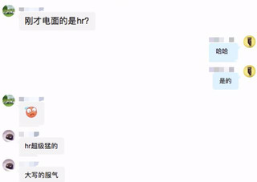
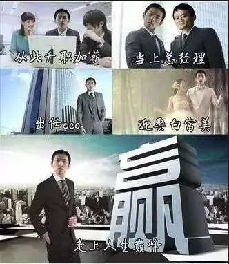
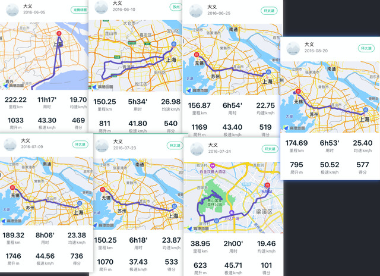
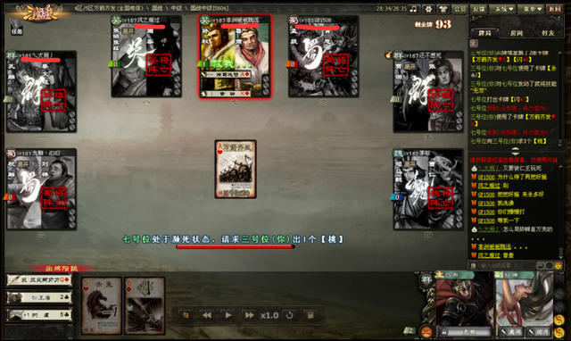
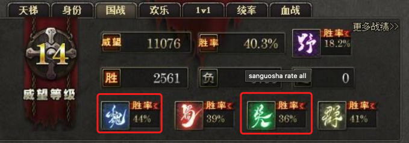
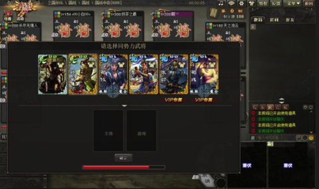
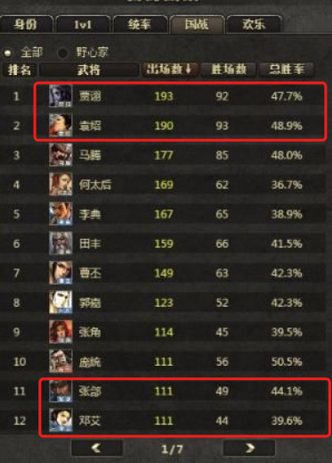
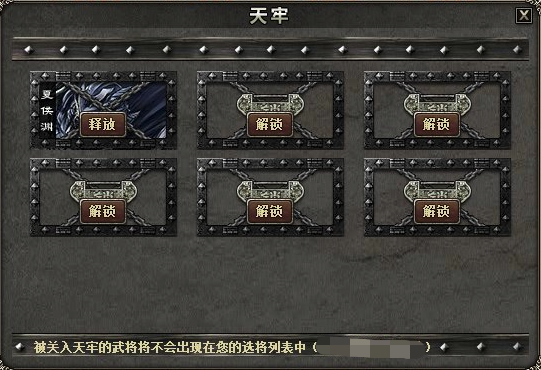

刚入职场就选中了自己喜欢的行业无疑是幸运的，但并非每个人都能如此。

听说我经历的人第一反应往往是“卧槽？！”， 今天就讲讲这个“卧槽”的故事 😁

### 初入职场

我出生在东北的一个普通村子，按部就班的读书、上大学。我一直坚信老妈的话：“上了大学就解放了~” 于是在非常踏实的玩了 4 年后，我毕业了。

大部分刚毕业的少年，都想赶紧摆脱对父母的经济依赖，过上自己的小日子吧（这几年卷的厉害，估计有所变化 👀 ），我也不例外。因为没别的想法，所以**赚快钱**就成了唯一的想法。

听说有个职业叫猎头。每日或西装革履，同大拿探索行业趋势，聊业务规划、职业规划；或如特务一般，用各种手段找到目标人选，并游说策辩使之加入客户，且收入不菲。听起来很 👍 有没有？

于是我加入了一家猎头公司，我想接下来的生活是：

接单、找人、面试、offer、入职，工作有条不紊的开展，一些场景也时不时的出现：

- 两个费用差不多的单子，一个很重要、但很难做，一个很好做，怎么选？

> _先把简单的做了，钱到手再说，难的可以慢慢来嘛。_

- 客户 X 觉得候选人能力可以，但薪资期望太高，怎么办？

> _对客户：“人选很优秀，市场上很抢手，Y 司给他开的总包是 N，有机会咱们还是尽量争取一下。我也再深入了解下他的想法，看能不能尽量让他接受咱们 offer。”_

> _对候选人：“X 给的薪酬同级别里基本是顶尖的了，而且他们内部晋升很快。 Y 虽然给的多一点但基本入职即巅峰。X 这边还... Y 这边... 当然，我尽量帮你争取下，除了薪酬，补贴、期权之类的看还有多少操作空间...”_

- 候选人拿到了客户公司 A 的 offer，不过自己手里也有公司 B 的 offer，怎么办？
- 如果 B 也是你运作的客户，并且这个 offer 也算你的业绩，你的做法会不同么？
- ......

做的多了，自然就看清楚了。**猎头的核心就是拿回款**。探索行业趋势、职业规划，都只是为之服务的。

- 有些公司你知道是个坑，但佣金就是多，它的职位做不做？

- 你也觉得候选人手里的 offer 比客户的好，但你会不会再努力争取下？

- 有些候选人入职不久就后悔了，但只要过了 3 个月试用期你就能拿到全部回款，你会不会劝他再观察下？

- ......

**但很别扭**。

我认真回顾自己一年的工作，发现除了回款那一刻，中间少有让我享受的过程。另外不考虑经济价值，我对自己真正创造了多少社会价值表示疑惑。工作是否就是这样？我不知道。但**我不希望自己的工作是这样**。

### 闷头乱撞

一个猎头想换行，第一考虑自然是 HR。一年多的猎头工作让我培养了基本的招聘能力，16 年 3 月，我加入了 Gllue。

再不用每天了解不同行业、不同客户，只需专注自己所在的行业、公司即可；再不用为提成做一些违心的事情，每个面试者都是潜在的同事，沟通交流更坦诚顺心；再不用每次面试后催促客户反馈，还要不停思量其中的真实度，直接拉上面试官讨论得失并调整即可。多了一些真诚，少了一些套路。工作不再是一件很别扭的事情。

当时招聘岗位以研发为主。研发团队不到 10 人，技术面试时间往往又很长。一个工程师一天面试几个人基本就没时间做事情了，而候选人还经常无法通过技术面试。肉眼可见的是，研发投入了大量时间，但产出很低。

尽管研发同学理解和接受这个情况，但我依然想尽量改善这个情况。

调整方向？能保证调整的方向一定对么？

提高简历标准？拜托，小公司招人已经很难了，这样搞只会错过一些潜在的优秀人选。

那怎么办？

很简单，研发怎么干我就怎么干。

我收集技术同学常问的问题，并自己旁听一些面试，观察他们的面试及判断方式，然后自己尝试做技术面试。具体可以看这篇[初创公司 HR 如何快速招聘研发精英](https://mp.weixin.qq.com/s/ukxm8wxqcZ-YTRmr2QSo0Q)。

效果还不错，面试通过率提高了很多。而且面试者会觉得很新奇，觉得这里的技术氛围应该真的很不错（连 HR 都会做技术面试 😳），很多人会愿意推荐自己的同学、朋友前来试试。

尽管没有品牌，没有市场知名度，但招聘工作依然很顺利。

 

主观上说，当你在一件事儿上尝到甜头，自然愿意投入更多的时间。客观来讲，简单问题的筛选效果在弱化（有部分被内推的机智少年已提前刷好“面经”😓）。

所以我不再拘泥于简单的收敛性问题，开始进一步了解技术，扩充“问题库”，甚至会自己做一些 demo 玩玩。

同时我还会读一些书，如《精益创业》、《第五项修炼》、《Rework》、《How Google Works》之类的。为什么读这些？公司书架上放的就是这些 🙄 ，既然看到了，就看一看。书的含金量可能没那么高，但持续输入总归不是坏事儿。

我也参加投资人为被投企业举办的一些行业会议，认识和请教一些人事领域的前辈。

总的来说，16 年是充实愉悦的一年。

17 年随着业务发展，产品、设计、客户成功、销售、财务等职位陆续开启，公司也试着让我接手员工关系、薪酬福利等人事工作。

我对新东西一向很有兴趣，但这次，我很快对这些失去了兴趣。推行考勤、核算薪酬、员工关系、团建之类的例行工作让我觉得很无趣，甚至是浪费自己的时间。相比之下，我宁可将时间用在阅读、学技术、做招聘上。

此时我已经工作了近三年，我仔细分析了自己的想法和状态，并写了[青年在选择职业时的考虑](/blog/career-consider-for-young)一文。

我意识到刚毕业那会儿，自己最想搞快钱，所以进了猎头行业。

工作一年后发现围着钱转的生活并不美好，从本心来讲，我还是想做些真正有意义的事。所以做 HR 初期，看到自己的工作产生切实的社会价值让我很愉快。

此刻情况又不一样，我希望用自己喜欢的方式，创造更大、更持久的价值。显然例行的人事工作不是我喜欢的方式。

用毛教员的话说，**主要矛盾在不断变化**。

我对 HR 职业本身有什么热爱么？并没有，我很清楚自己喜欢的只是实实在在生产社会价值的过程 🤨

但只要还在干这行，我就必须让自己进步，不管是广度上还是深度上。

**但如果不享受工作本身，只是为了“职业发展”去学习和成长，我又能走多远？就算能走很远，这样的职业生涯，不会觉得无聊和遗憾么？**

我做技术面试本质上是承担了研发的工作。既然我享受生产价值的过程，为何不自己做直接生产者（研发）呢？

等会儿，**你确定不是因为研发的平均薪酬相对较高才想转行？** 这是个客观事实，我很难否认自己没受这方面影响。

所以我问了自己一个问题：“如果现在让我平薪转研发，我愿意么？” 答案是肯定的。

我又进了一步：“如果需要降薪呢？” 只是思考了很短的一会儿，答案依然是肯定的。

> _现在我也常用这个方法。比如某 app 月会员 10 块，年会员 80 块。我会买年会员么？我会问自己：如果年会员是 130 块我还会买么？如果是，那我会直接买年会员；如果否，即使优惠再多，我也只会买月会员。这样可以确保自己的选择出自内心，而不是商家诱导的结果。_

### 迈出第一步

确定了内心的真实答案后，我鼓起勇气提出了辞职，大家纷纷对我的勇气和决绝表示欣赏，并祝我一路顺风。我在家闭关学习了 3 个月，一出山，各路 offer 拿到手软，大厂哭喊着要我去做高管，“独角兽”们纷纷表示一定要我以合伙人的身份加入。

---

抱歉刚走错片场了......

尽管我很想说自己“杀伐果断”，毅然转行，迅速开启了新的职业生涯，但事实并非如此。

理智上知道自己该果断行事，但身体依然很纠结。自己看了那么多简历，很清楚转行给人的第一印象往往是负面的。而且 HR 转研发怎么看都太 tm 诡异了，研发转产品、转销售、转招聘的没少见，但反过来的听过几个呢？我该迈出这步么？我能做成么？

就这样在纠结中，我一边工作，一边零碎的学东西。两头用力的结果就是两头无法兼顾，技术没多少积累，工作也做的一般。一天偶然翻翻日记，愕然发现自己已经纠结了小一年，顿时连骑行都不香了。

> _现在骑行，骑不出去年轻松自在的味道了（我是说心态上，不是体能上）。周末骑行去杭州，完全没有兴奋的感觉。什么因素呢？准备比较匆忙？最近比较 suffer？还是什么其他的？—— 2018-04-02_

我突然意识到自己就这样浪费了一年。

我一直坚信：**人可以笨，但不能蠢**。笨是相对的，蠢是绝对的。在纠结中浪费自己的时间毫无疑问是最蠢的行为之一。

事实很清楚，再不决定，一年后我还会继续纠结自己要不要转型，是时候做个了断了。

我能沉下心做 HR 么？别忘了自己一直是野路子发展的，如果有个更优秀的 leader 带我实操更多优秀的方法论，会不会好些？

我接触了一些大厂，然后意识到优秀的 leader 能帮助我成长，但解决不了我对职业的兴趣问题。

事实越发的清晰了，不试试自己搞研发我是不会甘心的。**迈出这一步我可能会后悔，但不迈这步我 tm 肯定会后悔。**

那就干吧 🔥

留在 Gllue 明显没足够的学习时间，是时候离开了。

### 蹒跚前行

自己闷头学很容易和社会脱节，也许还有一些给自己留退路的想法，我决定“半工半读”。

18 年 5 月末，我加入了 [ZILLIZ](https://zilliz.com/)。选择它有几个原因：

- 此时 [ZILLIZ](https://zilliz.com/) 和 16 年初的 Gllue 很类似，10 余人，主要招聘研发；
- 我表达了自己除研发招聘外，不想涉及其他人事部分，并得到了同意；
- 尽管人少，但都是技术大佬。

熟悉的环境，最简洁的工作，确保我可以用最短的时间做完工作，剩余的时间用于学习。

不觉过了近四个月。一天 Charles（[ZILLIZ](https://zilliz.com/) 创始人） 告诉我公司 offer 了一位人事总监 M，而且 M 很快会入职。

我立刻意识到自己没法儿继续“偷偷学习”了。M 入职必然会开展一系列工作，我不可能独身事外。

只思考了半小时我便决定，告诉 Charles 我要转研发的想法。

坦率说，我没对这次沟通抱太大期望。尽管我不认为裸辞是件聪明的事儿，但既然“半工半读”似乎不可行，我不介意试试这条路。虽然只有自己练手的项目经验，但我依然准备直接投递一些研发岗。甚至准备找老东家探讨我以研发身份回流的可能。

出乎意料的是，Charles 听到我的想法后只是有点意外，但他甚至没有再考虑一下就同意了。正好公司官网要改版，他让我一边协助改版，一边帮 M 做招聘，前端负责人到岗后，再全职转研发。

很意外，也有一丝庆幸，当天晚上我留下了这样的记录：[^注1]

> _一转眼又两个月没记日志了。 想的，看的，终归是记录下来舒服些。 内部转前端看似顺利，不过依然有很多东西不好说。现在做的偏招聘，从自身视角来看我在浪费时间。 但内部转岗也是个难得的机会。 要不要出去试试？ 毕竟没有正经巴经的跟外面面试过。目前原理源码实现之类的东西的确了解一些，不过实践应用非常欠缺。投入的时间还是太少。 无论如何，既然选择了方向那就往前跑吧，不用想那么多了，我知道自己想要的是什么东西。 就如三国杀，游戏局数足够多，胜率还是能说明一定问题。人生也是一样，而且更有趣的是：我不需要一直成功，只要成功一次就够了。  Zilliz 或许是个机会。 再发牢骚成蒋光头了，看书去看书去。 —— 2018-09-13_

19 年 1 月入职了一位资深前端 B，我好开心，终于有大佬带我一起做项目了。

不幸的是，入职一个半月他就被辞退了 😓

19 年 4 月 J 兄入职。跟着 J 兄，我开始做自己的第一个商业项目 —— Infinity 大数据可视化平台。

调试的方法，工程的基本思路，源码的阅读方式...... 我不断从他身上学习。头脑中零碎的知识点，在项目迭代和自己的学习反思中，逐渐连成线，进而成网。各种概念、模式，不再是脑海里的一段文字，它们逐渐变成了真正的认知。

尽管工作强度很大，但那段时间我非常开心，自己每天的进步肉眼可见。我感觉自己终于“上路”了。

> _很久没有写日志了。  最近 J 兄 过来的确能帮我很多，同时自己越发的有些焦虑。  很多功能，明显感觉有更好的做法，但是找不到出路。  J 兄说这是必经的过程，如果不想让自己那样焦虑，那就要多写写代码，写多了自然就有感觉了。 ——2019-06-16_

> _又是好久没有写东西了，看着 6 月份的日志，真是有种啪啪打脸的感觉<苦笑脸>。 最近工作模式发现的主要问题： 1、相同的问题反复搜索，浪费大量时间。比如文字上下左右居中；相同的问题不能再犯。 2、代码逻辑还没清楚就急着动手，导致返工很多。现在不是自己设计新功能，要做的功能很明确，少年不能再犯相同的错了。 3、代码命名规则不规范，以后要明确；另外，语意不是设计的很好。找找一些代码设计规范，进行实现。 ——2019-07-22_

这个状态持续了 3 个多月。我知道自己依然在进步，但感觉进步速率明显在下降。

我知道前面飞速进步的很大原因是自己底子太差。就像中国经济体量不高时每年能保持两位数增长，但这不是一个可永久持续的状态。

我跟 Charles 聊了自己的感受，Charles 说 J 兄对我的评价不错，不像个新手。慢慢来，不要急。

我很理解。技术研发就是要脚踏实地、一点点积累，我不该着急。

但我怎么可能不急？**比起同龄人我至少落后了四年的时间**。我依然想更快的积累和进步，没关系，想办法就是了。

### 加速奔跑

我一直想做一个“树洞”类的网站，我决定就从这入手。

把自己当做核心用户，想需求、定排期，UI 设计不擅长就直接抄 X 乎，热火朝天的搞了几个月。虽然最终没上线，但收获也不少。不仅是技术上的收获，还有更多对产品、对商业化的思量。

20 年初，考虑到公司的规模、发展阶段，我觉得自己能做的、接触的东西还是比较有限，所以我准备出去看看。

我的目的很明确：

1. 弄清外面的前端在玩什么；
2. 弄清自己的短板，明确未来三个月要努力的方向；
3. 弄清行情。

现在就像“小马过河”，我心里一点儿底儿也没有。所以我决定照最坏的打算准备。

做招聘的时候知道，各个公司对面试未通过的人会有一些政策，一般会限制此人半年内不得投递类似职位。如果面试结果不理想，但半年内我还想再试试怎么办？

脑子一转，我决定搞一份“影子”简历。

作为一个曾在招聘管理软件公司干过的，深入研发团队的 HR，简历查重的基本方式不要太清楚。很快，一份姓名、手机、邮箱、学历、工作经历通通“脱敏”过的简历就出炉了。若面试成功，再用真实简历去面也问题不大；没通过也不影响日后再次投递。

我承认这个行为很无耻 😅，但的确从中获益良多。面过十余家公司后，三个目的都很好的达到了，甚至还有一些预期外的收获。

不过考虑到自己用的影子身份，而且媳妇开学后，我大概率要离开上海前往北京，所以这波儿面试全都推掉了。

### 意外发现

**当你看到一条直线时，它就只是一条直线；当你再看到一条与之相交的直线，你看到的不是两条直线，而是一个平面。**

面试结束后，我对公司的项目、自己的项目、以及成长过程做了一轮系统的复盘。

这个过程我越琢磨越觉得眼熟，某一刻突然想通了，这 tm 不就是活生生的“历史”么 🤦🏻

J 兄带我的前三个月，我脑子里的技术知识连成了一张网。现在这张网开始融合我对招聘、历史、工程、哲学等领域的认知了。

这个过程比我想象的更快，就像你突然发现了万有引力，然后发现它无处不在。我看到了无数的模式和它们背后的东西。

**我眼中的世界再不是从前的世界了。**

很多事情变得容易理解，很多问题在不同领域的表现形式虽然不同，但本质原因差不多，因此不同领域的解决方案可以很好的互相参考或交叉验证。

我从历史的视角重新审视工程，我以工程的方法分析哲学发展，越看越好看，越想越好玩。

这种感觉就像，当你试图用“地心说”解释天体运动轨迹，什么本轮、均轮的，越解释越乱越复杂；当你用“日心说”的观点，霍！事情不是很简单嘛 ~

J 兄让我调研 Kibana 源码，我看到的不是代码，而是它的发展“故事”。当看到它的作者也踩了我踩过的坑儿时，真的会忍不住笑出声儿。

我不再纠结自己的进步速度，因为知道自己已经走上正确的路。路漫漫其修远兮，进一步有一步的欢喜 ~

我也不再焦虑技术发展太快、技术栈太多。随着对其本质认知的不断加深，内心越发趋于平静。

看过的书，做过的事，每次重新思考都会有些不同的味道。我不再花大量的时间逛技术论坛，我想我已找到更适合自己的学习方式。

20 年 8 月，我跟着媳妇儿来了北京[^注2] ，以前端工程师的身份加入[神策数据](https://www.sensorsdata.cn/auto)。在自己喜欢和认可的行业里，享受创造的乐趣(和改 bug 的悲伤)，不觉就过了一年。

> _公司明年底大概率会上市，想上车的小伙伴可以找我内推。az15921869329@gmail.com_

以我当前的认知来看，我正处于一个新的荒原区。接下来要做的是观察、体验、探索、积累、持续输出，静待下一次爆发期的到来。不知为何我有种奇怪的预感，下一个爆发期不会太远。

### 回首

回头看看自己的过去，一些经历起了很重要的作用，下面单独聊聊。

#### “濒死”经历

15 年我和小伙伴儿去千岛湖。入住后一群人找了个合适的位置，就开始下湖玩水。

阳光明媚，温度适宜，水性好的向远处的对岸游去，水性不好的就在岸边或皮划艇上耍。我听着他们打闹，闭着眼在水面随意漂着（还有比这更蠢的行为么），再一睁眼发现自己离岸边已经很远（具体距离已记不清，反正一眼望去就感觉自己大概率游不回来）。

我想往回游，但此时起了风，风向是离岸的，游一米退半米，这 tm 就很扯。我想喊划船的小伙伴来接应我一下，但喊了几嗓子发现他们明显听不到。脚下湖水多深不知道，但把我淹了绝对绰绰有余......

卧了个大槽！！！😱😱😱

当我发现自己的小命可能真要玩完的那一刹那，心率瞬间飙升，全身肌肉僵硬，小腿隐隐要抽筋儿。

我不知道该怎么办，但我知道自己再不冷静下来，用不上两分钟就真的要完蛋...... 😵😵😵

我强行缓慢深吸几口气，然后和自己对话：别慌！之前一直在水上漂，没耗费多少体力。湖面没浪，水温不低，至少 20 分钟内我绝对安全。

我知道自己说的对，大脑稍稍冷静了一下，心跳虽然依旧很快，但逐渐稳定了下来。

接下来还是要想办法上岸 🧠

我没穿醒目的救生衣；喊他们明显听不到；这么大的湖面、这么远的距离，挥胳膊他们也大概率看不见，不能指望他们了，还得靠自己。

我在水里转了一圈儿观察四周的情况：

- 往回游距离很远，又逆风，容易体力不支，风险太大；
- 往对面小岛游虽然顺风，但距离更远，而且情况未知，风险更大；
- 左手边连岸都看不到，不用想了；
- 右手边一直沿岸，距离不比回游长，而且不逆风。岸边都是水草，大概率岸边是浅水区。就它了！

字打了很多，但当时就是几秒钟的观察判断。

看上去很简单，但在当时的紧张心态下，冷静观察思考判断真不是件容易的事儿。

幸运的是尽管在水草中被小虫咬的很惨，但还是保住了自己的狗命。爬上岸后腿一软，一阵后怕。

这次经历让我获得了一个重要技能：**必要时刻，我可以压制情绪、让理智强行接管一切。**

因为理智，所以真实，这点在做重要决策时尤其重要。

每当我需要认真思考某件事，我能确保不会自己骗自己。我给自己的答案保证是内心最真实的想法。别扭就是别扭，喜欢就是喜欢，没兴趣就是没兴趣。基于真实，我可以对自己的处境做更好的判断，进而做更适合自己的选择。

#### 骑行

我一直很喜欢骑行。小学靠一辆童车逛遍了周边的十里八村；高考后的两个月，我和自己的第一辆公路车一起逛遍了鲅鱼圈及周边；大学里也没闲着，上海基本跑了个遍；毕业后偶然加入了“启程单车”，既参加组织活动(如环太湖、马自骑【24 小时内不间断骑行 421 公里】)，也自己单飞(上南京、下扬州之类的)，上海周边的城市基本都打过卡。

骑行让我意识到：**如果你喜欢一件事，你一定会经常主动去做它**。

今年东京奥运会女子自行车公路赛冠军 Anna 火了，大家觉得她自己制定训练计划、研究体温反应、研究路况的行为很有趣，我只感到亲切。因为在 16 年备战川藏线时，我干过类似的事情。

在半年的备战时间里，我基本每 1 到 2 周会骑一次长途训练体能。上海骑行到无锡的距离最合适（150 公里），而且还有个 300 米左右的惠山方便训练爬坡，所以这条线路跑的最多。

每次我会刻意控制自己在不同的心率、踏频下运动，然后分析：

- 不同心率下的体能消耗；
- 最舒适持久的踏频；
- 多久补充一次碳水可以保持血糖稳定；
- 当前瓶颈是心肺功能还是肌肉耐力，并针对性提升(为此我跳了一个多月的 Insanity，一套强度很高的减脂健身操，需要资源的同学可以私信我)
- ......

根据自己的实测数据，我制定了 13 天完成川藏线的计划。听上去很疯狂，但我知道可行性很高。

说这些的重点并不是想吹自己有多强(好吧我的确想嘚瑟一下)，重点是我意识到：**当你因喜欢而做一件事，你自然会想把它做的更好。为之努力不会觉得辛苦，反而让你觉得享受**。

遗憾的是当年我没能完成计划。下二郎山的路上我摔了一跤。虽然左膝和大腿蹭掉了一大块皮，但肌肉、筋骨没受到什么实质伤害，所以我继续按计划前进。

但持续骑行导致伤口一直无法很好的结痂，每天骑行结束，骑行裤上都会沾满一大片渗透液。

尽管行程正常、体能正常，但思虑再三(万一感染，又是在高原地区)，还是狗命要紧。于是我在理塘前沿放弃了这趟行程。当时好不甘心，可以说这是自我上大学后，最用心准备的事儿。我打电话给老妈，哭了好久......

尽管很遗憾，但在回成都的路上，我发现很多自己在去程没注意的风景（之前为了赶时间，每天只顾低头傻骑）。日后回想起这段经历，尽管有些遗憾，但依然觉得很美好。我意识到**做内心喜欢的事儿，无论结果如何，都会成为人生的美好回忆**。（当然，川藏线，我还会再回来的 🤓 ）

对我而言，正是因为清楚自己在骑行中的状态，所以我知道自己在工作中的状态有很大改善空间。才会进一步反思、对比，最终踏出这一步。

你也可以想想，有没有这样一件事，你为它准备的时候很用心、做的时候很快乐、回忆起来很美好，而且不会觉得空虚寂寞无聊或浪费时间。如果有，可以试试让生活中的其它方面也处于这个状态，你的生活可能会得到很大改善；如果没有，那就多试试，多找找，一定找得到。

#### 三国杀

刚上大学那会儿，被狗哥安利了三国杀，自此入坑。

我尤其喜欢国战模式，因为喜欢所以更想玩的好，胜率显然是最明确的指标。

我在游戏中认识了「非洲爸爸跳远」，这厮国战胜率居然高达 44%（玩国战的朋友应该明白这个胜率的含义。像我这样的普通玩家胜率只有 33% 左右，胜率 50 以上的，不敢妄言没有，但大概率是个刷子...）

我开始观察和模仿这厮的游戏思路，并很快偷师到“猥琐”、“控场”、“蓄爆”等国战精髓，胜率也开始稳步提升。我不难得出结论：**模仿是极其有效学习方式**。

每一盘游戏都是”宝贵“的经验来源：

- 什么武将组合攻守更平衡，什么组合适合 solo，什么组合适合开团...
- 敌人是高手怎么办，队友是小白怎么办...
- 什么时候该猥琐发育，什么时候该大胆出来开团，残局如何制衡...

想想真的很搞笑，我在游戏中明白了什么叫“故兵无常势，水无常形。能因敌变化而取胜者，谓之神。” 🤷

当你对游戏的理解已经非常深入，还能进一步提升么？

**只要思想不滑坡，办法总比困难多**。

假如下面是你的统计数据，魏国的战绩明显好于吴国。

此时，魏国是否是更好的选择？

假如下面是你不同武将的胜率。

尽管魏国的整体胜率较好，相比张郃 + 邓艾， 贾诩 + 袁绍是否是更好的选择？

还能进一步么？

既然选将的出现是随机的，可否关闭低胜率武将，从而增加高胜率武将出现的可能性？

......

渐渐的，我成了胜率 42.9% 的国战“大神”。

> _如果在大学那会儿就用这种精神认真思考未来的路 🤦🏻 ...... 罢了，好在什么时候开始都不算晚。_

对游戏的态度也在影响我对生活的态度。

- 开局候选武将是随机分配的，有时自己的组合就是很弱；
- 有人没有任何理由，突然就对你一阵开火；
- 明明大局已定，偏有队友专门挑钢丝走，然后就翻车了；
- “玩游戏就为了想赢有意思嘛”
- “胜率那么高肯定是刷出来的，垃圾！”
- ......

但我就是很享受认认真真提高自己胜率的过程啊 ╮（╯＿╰）╭

所以不管开局如何、战况如何、别人怎么说，我始终会按照自己的想法认真游戏。

我逐渐养成了一个习惯：当我想做一件事，**我不会再被自己无法控制的因素影响，我只会尽力把自己能做的、能影响的部分做到最好**。

#### 持续阅读和思考

我一直有阅读的习惯，小说杂志名著来者不拒。看的多了，就会有些有趣的发现：

> _忽然发现读书和消化的过程很像嘛。 吃掉一块蛋白质，把它分解成氨基酸，然后再组合成你的蛋白质，就长成了你的血肉。 把一篇文章，分解成一个个观点，一句句话，一个个文字，再重新组合成新的文字，它就成为了你的思想，也就变成了你自己的东西呢 —— 2017-04-08_

食物有好坏，书也一样。

读好书就像在脑子里种下一颗种子，随着时间的推移，不知何时它就在脑海里开了花。

就像我在上文提到的“意外发现”。

所以像抖音、快手、头条、UC 这种看过后毛都记不得的东西，还是统统删掉吧。

### 后记

现在、以后，依然会有很多人经历对职业的迷茫、对自己的反思、对踏上新路的忐忑。我的想法、做法当然不是标准答案，但至少是一条真实有效的“参考答案”。

其实我很懒。据老妈说，我说的第一句能完整表达自己意思的话是：“好累呀...”

但想到懒人稍勤快一点，可能会让更多人少走一丢丢弯路，多少还是有点儿动力的。当然，如果你看到这愿意**点个赞、关个注、留个言、赏几两碎银子**，懒人就更开心了~ 😆

坦率说，自己在下笔的时候也纠结了几次。干嘛写的这么真实，把自己包装成一个破釜沉舟，成功转型的“大佬”不爽么......

> _因为讨厌成功学家们空洞的语言，才想起记录自己每日的想法。这样当我将来成功时有后辈向我讨教经验，这本日记将教给他们最真实的方法和成功的原因。——2014-01-12_

就当是满足过去自己的一个小小愿望吧。😜

日后还会继续输出，也欢迎各位投稿、留言。

再次建议大家读读[聪明人的个人成长](/blog/translation/pdfsp/summary)系列，祝大家都能有意识的生活~

[^注1]: 当时并没什么感觉。几年后当我回顾过去，才意识到自己当初有多幸运。个人情感上我并不喜欢 Charles，但我必须承认，在我转型的关键节点上，他给了我一个极其难得的机会，我想余生我都会为此感激他。[ZILLIZ](https://zilliz.com/) 20 年刚拿了 4400 万美元 B 轮融资，上海或杭州对之有兴趣的小伙伴可以去关注下。
[^注2]: 想着刚处对象那会儿，因为自己坚持认为异地不靠谱，各种软磨硬泡把她骗到了上海。然后又被她反骗到了北京。不得不承认，高端的猎手往往以猎物的形式出现 🤷
