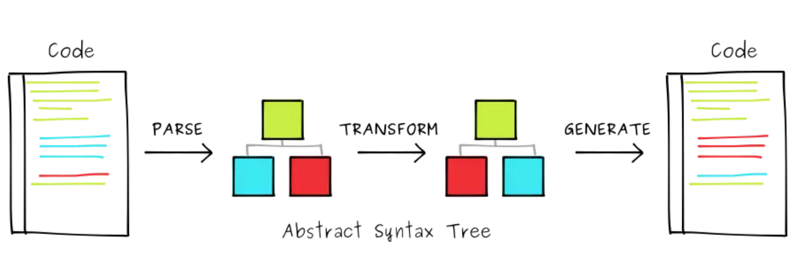

## Why babel?

当我们想拼接一个字符串。

```javascript
// 语法a：麻烦，但浏览器能执行。
var name = 'Your name is ' + first + ' ' + last + '.';

// 语法b：简单，但浏览器不认识(现在已经认识了，只是用来举个例子)。
var name = `Your name is ${first} ${last}.`;
```

如果有个工具能把 a 编译成 b 就爽了！ 🤔

于是 babel 出现了。

**<font color="red">babel 的出现使我们可以更早的使用提案中的、尚未被执行环境(浏览器/NodeJS 等)支持的 JS 语法，从而提升开发效率和舒适度。</font>**

## 核心机制

babel 的执行分 3 步：

1. 解析(源码 => AST)

2. 转化(AST => AST')

3. 输出(AST' => 目标代码)



<font color=grey>_对 AST(抽象语法树)不太了解的同学，可以在[AST Explorer](https://astexplorer.net/)上学习体验。_</font>

最需我们关注的是「转化」，这部分功能由 babel 的各种 plugin 实现。

如你需要转化 React 的 jsx 语法，需在 babel 配置文件中添加对应的插件

```javascript
module.exports = {
  plugins: ['@babel/plugin-transform-react-jsx'],
};
```

在实际工作中，当你使用 React，至少需要配置@babel/plugin-syntax-jsx、@babel/plugin-transform-react-jsx、@babel/plugin-transform-react-display-name 三个 plugin，才能保证功能正常运行。

这时我们可以用 preset 进行配置，preset 是一组插件的集合。

```diff
module.exports = {
- plugins: ['@babel/plugin-transform-react-jsx'],
+ presets:['@babel/preset-react]
};
```

## 总结

babel 的本质就是一个编译器。

工具的出现是为了解决特定问题。为了切割物体，人们发明了刀子；为了更早使用 JS 语言新特性，人们发明了 babel。

一个好的工具往往会有很多应用场景。

对刀子，厨师可以用之切菜；艺术家可用之雕刻；士兵可以用之杀敌。

对 babel，webpack 可以用之做打包工具；eslint 可以用之做语法检查；”轮子哥“们可以用之创建新的语法。 😅

当你尝试了解一个新工具，不用迷失于其繁复的应用场景中。<font color=red>把握其出现的原因，最核心的功能即可。</font>

## 参考资料

[深入浅出 Babel 上篇：架构和原理 + 实战](https://bobi.ink/2019/10/01/babel/)

[Zero-config code transformation with babel-plugin-macros](https://babeljs.io/blog/2017/09/11/zero-config-with-babel-macros)

[I Can Babel Macros (and So Can You!) - Shawn "swyx" Wang | JSConf Hawaii 2019](https://youtu.be/1WNT5RCENfo)
