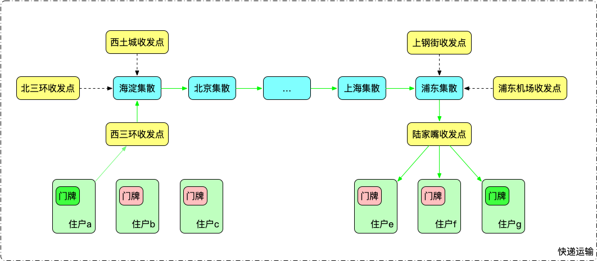
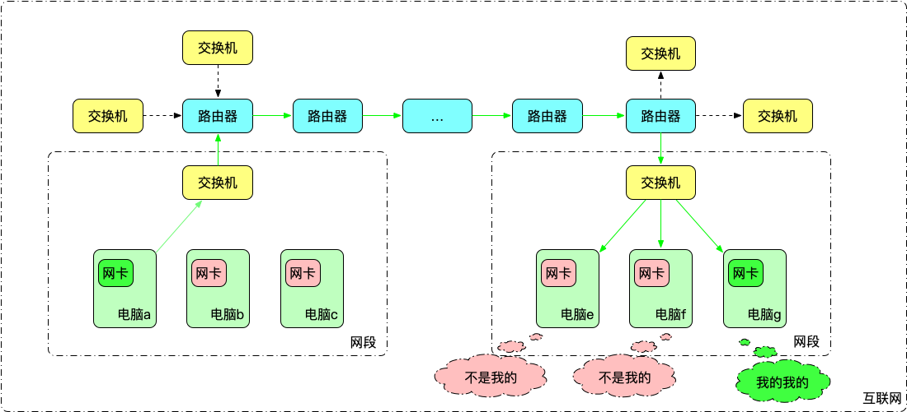
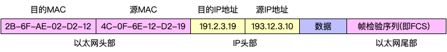
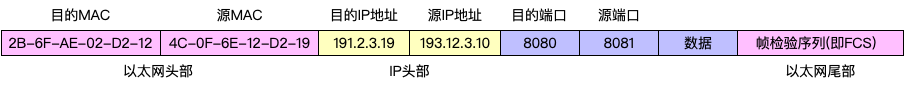
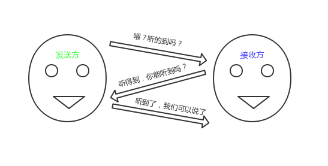
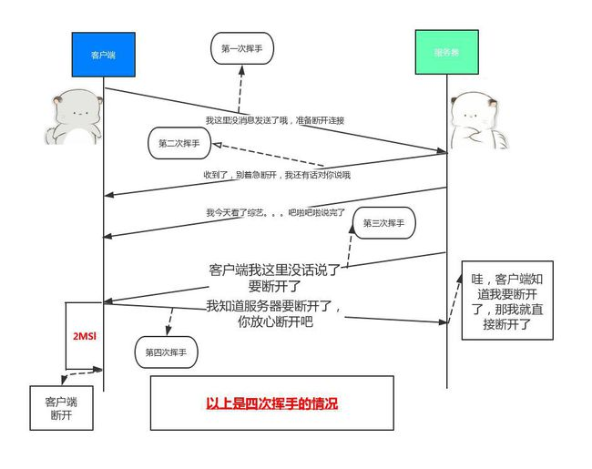
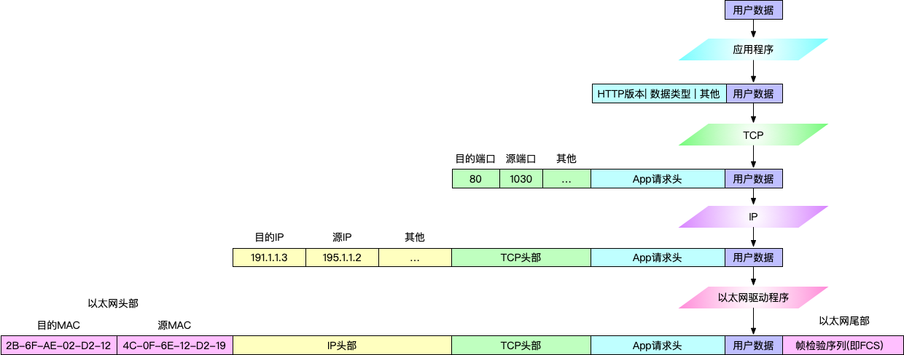

### 导读

目标：建立对计算机网络基础的整体认知。

预计阅读时间：15min

适用群体：

- 被广域网，局域网，网桥，网关，交换机，子网掩码等各种名词困扰的萌新；
- 啃《TCP/IP 详解》等教科书啃到哭的苦逼工程师；
- 正在准备面试的求职者。[^注1]

### Before We Start

忘掉脑中零碎的概念、认知，让我们从最简单的地方开始。

### 物流？数据流？

快递包这样走：

数据帧这样走:

**快件**是快递运输的基本单位，**片区**内住户可以直接互送快件；每个片区有一**收发点**，外来快递由收发点统一派送，送往外部的快递，由收发点统一转发给上级**集散站**；每个集散站负责多个片区，集散站之间进行快递转发，并把属于自己片区内的快递分发给对应收发点。

**数据帧**是网络传输的基本单位，**网段**内主机可以直接相互通信；每个网段有一**交换机**，外来数据帧由交换机广播给所有主机，发往外的数据帧，由交换机统一转发给上级**路由器**；每个路由器负责多个网段，路由器之间进行数据帧转发，并把自己负责网段内的数据帧分发给对应的交换机。

### 认识~~快递包~~数据帧

一件完整的快递至少包含：收件人地址、收件人手机，发件人地址、收件人手机，被寄送物件。

数据帧跟快递真的很像 🐶 🐶...

- 目的 MAC => 收件人手机

- 源 MAC => 发件人手机

- 目的 IP 地址 => 收件人地址

- 源 IP 地址 => 发件人地址

- 数据 => 被寄送物件

一个完整的数据帧如下所示：

这里需补充一点基础知识：

> - 以太网规协议定，接入网络的设备都必须安装网络适配器，即网卡;
> - 数据帧必须是从一块网卡传送到另一块网卡，网卡(MAC)地址就是数据帧的发送地址和接收地址;
> - MAC（Media Access Control） 地址，是每块网卡的身份标识，具有全球唯一，采用十六进制标识，共 6 个字节， 前三个字节是厂商编号，后三个字节是网卡流水号。

另外数据帧多了个**帧校验序列**，其作用是让接收数据帧的网卡或接口判断该数据帧是否发生了错误 [^注2]。

> 从这点上讲数据帧比快递靠谱多了，每次快递包出了问题都要自己主动去追问我快递哪去了... 😓

### 数据帧传递

发件人要发物件，先看收件人跟自己是否在同一小区， 如是，直接给他；不是，那就交给收发点转发。

主机要发数据帧，先检查目标主机跟自己是否在同一个网段[^注3]。是，直接把帧丢给对方；不是，就交由交换机转发。

> 行话：主机首先判断本机 IP 地址和目的 IP 地址是否处于同一网段。如在同一网段，假设发送主机的 ARP 表中并无目的主机对应的表项，则发送主机会以目的主机 IP 地址为内容，广播 ARP 请求以期获知目的主机 MAC 地址，而只有目的主机接收到此 ARP 请求后会将自己的 MAC 地址和 IP 地址装入 ARP 应答后将其回复给发送主机，发送主机接收到此 ARP 应答后，从中提取目的主机的 MAC 地址，并在其 ARP 表中建立目的主机的对应表项(IP 地址到 MAC 地址的映射)，之后即可向目的主机发送数据，将待发送数据封装成帧，转发至本网段内的目的主机，自此完成通信。如不在同一网段，发送给交换机转发处理。[^注4]

### 传输要可靠，管杀还管埋

上面介绍了数据帧如何从一台主机传到另一台主机，不过主机上有很多程序，数据帧过来后给谁用？

在数据前面加上端口吧，哪个程序用了这个端口，就把数据丢给谁。

这就是 **UDP。** 通过 UDP，我们实现了应用程序间的数据传递。

但还有问题，快递都会丢件，数据帧想顺利传过去也不那么容易...

> 在路上，可能被防火墙拦了；可能路由器堵了；可能对方掉线了；可能被狼叼跑了...

如何保证数据帧传递到位？这就要聊聊**TCP**了。

为了确保传输通信可靠，至少要解决三个问题：

1. **如何建立连接和断开连接？**
2. **我发的数据帧，如何确认对方已成功接收？**
3. **一方掉线了怎么办？**

#### 1. 建立/断开连接

建立连接通过 3 次握手，断开连接通过 4 次挥手。

Q:为啥握手要 3 次？

> A: 因为 2 次靠不住，4 次属于脱裤子放屁。（话糙理不糙啊）

(图片来源于网络，如侵权请联系删除。)

Q: 为啥要挥手要 4 次？

> A: 因为 TCP 通信是双向的。我没啥传了(1 次)，你确认(2 次)；你也没啥传了（3 次），我也确认（4 次）。至此连接才可以完全断开。

(图片来源于网络，如侵权请联系删除。)

#### 2. "回执"机制

TCP 约定：

发出端发出一包后，会启动一个定时器，等待目的端发回“回执”。如没及时收到“回执”，将重发这个包。

目的端收到一个包后，会发一个“回执”，告诉发出端我收到了。

回执也是个数据帧，一个“回执”专门发一次，是不是有点浪费啊。。。

TCP 很鸡贼，它约定接收端不会立刻发送“回执”，而是先等等(一般 200ms 左右)看发送端有没有请求数据。要是有，就把“回执”塞到对方需要的数据里，一起发回去；要是没有，就专门发一个“回执”。

#### 3. 重置机制

TCP 设计了一套重置机制，专门处理断线、数据帧错误等问题。

如果接收方掉线了，你再重复多少次发送，对方也不会有响应。所以，TCP 默认 重传 5 次(次数可自行设置)依然失败，就重置这个连接。

如果某一方觉得对方或对方发来的数据有问题，也可以随时主动触发连接重置，以保障通信稳定和正确。

Q:为啥说 TCP 开销大？

> A: 先不说建立断开连接就要 3 次握手 4 次挥手；为了确认一个包正确到达，又要回执，又要重复发包，还要考虑对方是否掉线... ；还有很多很多本文没介绍的慢启动、拥塞控制、滑窗机制... 操这么多心开销能不大么。 😂

Q: TCP 这么牛逼，还要 UDP 干啥？

> A: 因为 UDP 快啊。如果对稳定性不那么看重(比如看电影，丢一帧两帧的无所谓)，传输更快它不香么？尺有所短寸有所长嘛。PS:HTTP3 就是基于 UDP 而不是 TCP，有兴趣可自行搜索阅读。

### 把数据用起来

感谢 TCP、感谢 IP、感谢 MAC，终于把数据安全的从一个程序传递给另一个程序了！！

但这坨数据怎么用？他是图片？视频？文本？彩蛋？还是啥玩意？？😕

> TCP 对字节流的内容不作任何解释。TCP 不知道传输的是二进制数据，还是 ASCII 字符、EBCDIC 字符或者其他类型数据。

显然，这需要两端的程序约定好用啥协议，传的是个啥，该怎么处理... 等等。

怎么办？在数据头上拼好这些信息呗 ~ 这就是 HTTP、POP3、SMTP 这些协议干的事儿了。

最后让我们看看从数据到一个完整的数据帧的包装过程：

### 结尾

等等啊喂，协议讲了这么多连 OSI 七层模型也不介绍？

不止这些，广域网、网桥、网关、ARP、DARP、IP 协议、路由协议之类的，都没介绍，如无必要，勿增概念。[^注5]

[^注1]: 笔者当前工作于 [神策数据·营销云](https://www.sensorsdata.cn/features/marketingCloud.html)。如希望内推，请将简历发送至anzhen@sensorsdata.com。
[^注2]: 校验原理可参考： [crc 计算和原理](https://zhuanlan.zhihu.com/p/348823629)，非网络工程师不必深究。
[^注3]: 具体方式是将两个 IP 地址分别与本机子网掩码作按位与操作，结果一致则在同一网段，否则两者分别位处不同网段。
[^注4]: 如果行话看着太累，跳过即可。
[^注5]: 偷自“如无必要 勿增实体”。笔者认为学习应先关注问题本质及核心解决思路，在学习解决方案及衍化的过程中逐渐理解概念和细节不迟。

### 参考资料

[TCP/IP 协议族到底怎么回事](https://juejin.cn/post/6844903906926051341)

[你了解快递就能明白什么是路由器和交换机](https://news.mydrivers.com/1/598/598051.htm)

[TCP/IP 详解](http://www.52im.net/topic-tcpipvol1.html)

[以太网发展史](https://www.ituring.com.cn/book/tupubarticle/8234)

[有了 IP 地址，为什么还要用 MAC 地址？ - 你好啊世界的回答 - 知乎](https://www.zhihu.com/question/21546408/answer/149670503)

[子网、局域网、网段的关系](https://cloud.tencent.com/developer/news/453553)
