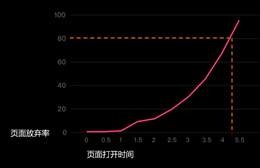

### 导读

目标：理解性能优化核心思想，从此不死记”雅虎军规“这类信息。

阅读时间：10-15min

### Why 性能优化?

对于当今网页产品，页面性能的重要性不言而喻。

### 指导思想

想对一段程序做性能优化，首先要了解其**整体过程**。没有调查就没有发言权，不做正确的调查同样没有发言权！[^注1]

其次，性能优化的思路无外乎三种：

**串行优化**

> 每个阶段执行效率提升，整体性能自然提升。

**并行优化**

> 小明早上起床，叠被用 3 分钟，洗脸用 4 分钟，烧开水用 10 分钟，吃早饭用 7 分钟，整理书包用 2 分钟，最短多久可完成所有？

**流程优化**

> 每个阶段都必需么？尽可能删减流程自身，以节省运行时的真正耗时。

### 跟着“指导思想”走

#### 整体过程

一个网页从发起请求到加载完成的过程，基本可描述为： _DNS 解析 => TCP 链接 => HTTP 请求 => Server 响应回复资源 => 浏览器解析执行(JS/CSS/HTML) => Render Tree 合成=> 渲染(计算布局/绘制) [^注2]_

#### 串行优化

一个任务，想用更短时间做完，要么压缩任务量，要么提高执行效率。

每个阶段可优化空间基本如下：[^注3]

<table>
  <tr>
    <th></th>
    <th colspan="2">压缩任务量</th>
    <th colspan="3">提高执行效率</th>
  </tr>
  <tr>
    <td></td>
    <td>非必需任务不做</td>
    <td>必需任务尽量压缩</td>
    <td>复用</td>
    <td>“堆人”</td>
    <td>提升效率</td>
  </tr>
  <tr>
    <td>DNS解析</td>
    <td></td>
    <td></td>
    <td></td>
    <td></td>
    <td>DNS prefetch</td>
  </tr>
  <tr>
    <td>TCP链接</td>
    <td></td>
    <td></td>
    <td></td>
    <td></td>
    <td>
      握手效率； 
      挥手效率； 
      传输效率
    </td>
  </tr>
  <tr>
    <td>HTTP请求</td>
    <td></td>
    <td>
      压缩请求数量； 
      压缩请求头；  
      压缩请求体
    </td>
    <td>复用tcp链接</td>
    <td>增加跨域请求</td>
    <td>
      少用重定向； 
      http2、3
    </td>
  </tr>
  <tr>
    <td>Server响应</td>
    <td>懒加载； 动态引入</td>
    <td>
      压缩JS文件; 
      压缩CSS文件; 
      压缩图片; 
      ... 
    </td>
    <td>
      客户端缓存； 
      服务端缓存
    </td>
    <td>负载均衡</td>
    <td>
      动静分离； 
      CDN
    </td>
  </tr>
  <tr>
    <td>JS解析、执行</td>
    <td></td>
    <td></td>
    <td>"JIT"； Memory</td>
    <td>worker</td>
    <td>
      时间复杂度； 
      空间复杂度
    </td>
  </tr>
  <tr>
    <td>DOM、CSS解析</td>
    <td></td>
    <td>减少DOM层级</td>
    <td></td>
    <td></td>
    <td></td>
  </tr>
  <tr>
    <td>Render Tree合成</td>
    <td></td>
    <td></td>
    <td></td>
    <td></td>
    <td>CSS选择器优化</td>
  </tr>
  <tr>
    <td>Layout(Reflow) + Paint(Repaint)</td>
    <td>
      减少次数
    </td>
    <td>减少涉及范围</td>
    <td></td>
    <td>复合图层</td>
    <td>
      硬件加速； 
      CSS属性优化
    </td>
  </tr>
</table>

日后看其他性能优化文章，应该了解其是通过什么方式、优化了哪里的性能。比如为什么要把从 http 的协议版本从 1 升级到 2？

#### 并行优化

并行优化，要知道哪些阶段可以并行运行。

**JS 文件的下载和 HTML 解析可以并行执行**，前提是 script 标签加上 async 或 defer 属性。所以一些广告、监控类的，不会操作 DOM 的独立 JS 文件，可酌情添加 async 或 defer 属性，以增加并行，减少整体耗时；

> _图片来自网络，如侵权请联系作者删除。_

浏览器 JS 引擎是单线程的，但**work 线程可与其并行运行**。所以可用 worker 处理一些计算密集型任务，以防止页面阻塞。

还有哪些过程可并行执行？可自行进一步学习。**(伸手党是没有前途的)**

#### 流程优化

流程优化，重要的是质疑和思考。

对于单页应用，Server 返回的 HTML 的 root 节点都是空的，需要客户端自己再请求数据，并进行相应的填充。为什么不直接让 Server 直接返回数据填好的、页面渲染后的完整的 HTML？所以业界产生了 **SSR** 方案；

网络稳定传输必须用 TCP？google 发起的 HTTP3 在 UDP 上层实现安全机制，从而丢弃了 TCP，实现传输效率的大幅提升；

流程的形成有一定原因，但不见得在当下依然是最优解。多质疑、学习、思考，这个时间不会被浪费。

### In Practice

实际工作中，我们需额外考虑两个问题：

1. 资源（时间、精力、金钱）有限，如何用“小成本”产生“大收益”；
2. 当我们宣称页面性能得到了巨大的提升时，需要有具体的数据支撑。

两款工具推荐使用：

- [Lighthouse](https://developers.google.com/web/tools/lighthouse?hl=zh-cn): 快速获得一份专业页面性能报告，获取性能存在的问题；

- [Performance](https://developer.chrome.com/docs/devtools/evaluate-performance/): 定量分析每个过程具体时耗，有助于发现可优化阶段、衡量优化效果。

某些页面，性能优化空间实在有限。此时可以换个思路，用 loading 图标、骨架屏、亦或是其他方式改善用户体验。

性能优化是解决问题的一种手段，但不是唯一手段。

### Ending

性能优化方案多而杂，且会不断演进变化。

但无需刻意记忆，弄清过程、记住“指导思想”，该怎样优化自然知晓。

留一道作业题：如何对自己所在公司的 **「开发流程」**做“性能优化”？

### 拓展阅读

**重点推荐** => [浏览器的工作原理：新式网络浏览器幕后揭秘](https://www.html5rocks.com/zh/tutorials/internals/howbrowserswork/)

[浅析 DNS 域名解析过程](https://cloud.tencent.com/developer/news/324975)

[提高 TCP 性能的方法，你知多少？](https://xie.infoq.cn/article/681d093ffc06d594de54992b9)

[^注1]: 前半句是教员说的，后半句也是教员说的。
[^注2]: 不甚了解的同学，可参考[前端经典面试题: 从输入 URL 到页面加载发生了什么](https://segmentfault.com/a/1190000006879700)
[^注3]: 遗漏之处，烦请点击页面左侧微信图标，提醒笔者进行补充，不胜感激~
