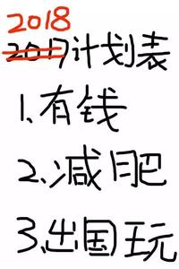

现在，

社会不能轻易忽悠你啦！

你觉得自己也知道自己的目标是啥啦！

但是...

> “这个目标太大了，短期弄不完，先玩一会儿吧。“ 于是看看微博，刷刷短视频，一天就过去了...

> “没时间啊，工作那么忙，上有老下有小的一堆事儿，等忙完这些我就去做...” 然后就没有然后了... 😓

目标、计划，就这么一年年”传承“下来了 👇

其实所谓“没时间”、“日后慢慢做”、“没有干劲儿”，都是表象。

根本原因只有一个：

**你对实现它的渴望，没你以为的那么强烈。**

> “我一定要考个好大学！再来最后一把王者！”

你对好大学没那么渴望，可能只是觉得自己该找个方向努努力。

> “等我财务自由了，第一件事儿就是去环游世界！”

也许你真的想环游世界(我也想)，但知道有些事情更重要，所以才先说财务自由。

> “三天三夜没吃了，快饿死了！看完这集电视剧就去吃饭！”

谁快饿死的时候还会想着看剧啊 🤣

**真正让你强烈渴望实现的事，一定会让你情绪起伏，并立刻行动。**

如果一个目标没给你这样的感受，不要为之浪费时间。

你应该去发掘真正会驱使你立刻行动的目标。

### 如何发现这样的目标？

#### 受点儿“刺激”

苏秦穷困潦倒，被家人冷淡，感慨人情冷暖，于是立刻“头悬梁锥刺股”；

李斯当小吏时，看到同样是老鼠，粮仓里吃粟米的脑满肠肥，厕所里的吃屎都不得安宁。 感慨一个人有没有出息，只是由自己所处的环境决定的罢了，掉头就找荀卿学习；

中国在近代被连续“刺激”了 100 多年，悟了“落后就要挨打”，直到现在也没停止对“独立自主”和“发展”的追求；

......

这个方法的优势是好理解、易上手，谁还没个“3 分钟热血”的时候呢？

但弊端也显而易见。

一、太依赖外界环境。如果生活不给你刺激，就没什么动力，时间就这样白白流逝了；

二、大部分刺激“疗效”很短。如果“疗效”很长，说明你受的“刺激”也不小，这样的“刺激”往往不是什么好事儿... 🥺

实际上，如果不是极度强烈的、“爱”“恨”之类的刺激（杀父之仇、救命之恩、生存之战），时间往往会轻松的抚平一切。

尽管如此，这依然是个有效的方法。

如果这个刺激真的让你内心颤动，即使这次你只行动了 3 分钟便放弃。

**它也一定会不停撩拨着你再次为之行动。**

也许下次依然是 3 分钟，也可能是 30 分钟，甚至更久。

暂时放弃是完全可以的，只要你依然想为之行动，什么时候重新上路都可以。

#### 体验新事物、吸收新思想

> “我本可以忍受黑暗，如果我不曾见过太阳。”

> “那些蒙昧了上千年的人们，一旦接受到知识的海洋，就像渴得快死的人嘴唇上沾了一点水滴，马上如饥似渴地狁吸起来。”

> “从来如此，便对么？”

> ......

如果自己总是懒懒的没动力，不妨想想：

“我有多久没接触让我感到新鲜的事物了？”

“我上次读完一本书是啥时候？”

“我的大脑、思想，已经多久没受触动了？”

......​

新的体验和思想，会让你有新的感悟和触动。

尤其是当你将它结合自己的生活，反思过去、思考未来，往往会有一个、甚至多个会驱使你立即行动的目标出现。

这个方法也有一个弊端。

如果你的“三观”还很不稳定，触动你的目标可能会经常变化。

要注意，别像“猴子摘玉米”一样，走一路换一路，看似忙了很久，却什么目的都没达到。

#### 觉醒自我意识

比较麻烦，需要深入“解剖”自己内心的勇气、需要时间和经历的浇筑、大量总结和反思，但效果也最好。

当一个人知道自己是谁、知道自己想要什么、知道还欠缺什么，他的时间和精力就会高度集中在自己想做的事情上。

他会从自己的“小宇宙”中获得无限的动力。

如何觉醒自我意识？

每个人的具体方式各不相同，但无外乎是靠学习、经历、挑战、反思和成长，所以每个人不同方式的背后有很多共同的模式。

这就是我特别推荐[《聪明人的个人成长》](/tags/Personal%20Development%20for%20Smart%20People)这本小书的原因。

理论很普适、实操性也很强，还有很多实例供我们参考。

### 理想的精神状态

在我看来，一个人最理想的精神状态，就像“活火山”一样。

表面风平浪静，内里却因滚烫的岩浆而炽热着、躁动着。

这个状态下的自己，会有明显感受到：**内心很炽热，仿佛有一股巨大的力量在驱使自己去行动；大脑像冰一样冷静，能保证前进的方向和效率。**

活火山不熄，就有喷发的可能；

人只要活着，就有达成目标的希望。

就像文章开头《那年那兔那些事》的截图。

尽管悲伤战友的死亡，但理智依然在线：“为了击退鹰酱，我必须活下去，所以不能哭，冻住的眼泪会影响战斗力。”

目标极度明确，无论内心如何波涛汹涌，头脑都能保持冷静，并坚定地继续前进。这就是我暂时能想到的，作为个体的、最理想的精神状态了。

### 最后

终于，我们找到了那个目标，内心炽热的忍不住要立刻行动。

可以直接一通“王八拳”抡过去，也可以学点儿“套路”再去干，磨刀不误砍柴工嘛。

幸运的是人类历史那么长、前人们已经为我们探索了很多有效的“套路”。

请看下章 ~
