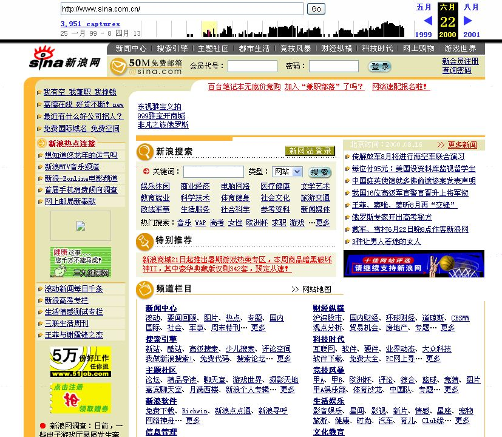

### 为啥写这个

一、当然是为了嘚瑟 😆；

二、当我还是个小白，被 webpack 一堆配置困扰了许久，希望这篇能让其他新人少点儿困惑；

三、准备在转移精力前，再输出一点儿东西。

最近反思了下。我的确很想帮别人，但是得承认，我现在就是个再普通不过的本科生。

我觉得媳妇儿说的对，如果我想更好的帮助别人，不如先让自己成长为一个更高层次的人，能在更高的层次更好的帮助我想帮助的人。党内还讲究“进修”呢不是？

后续一段时间，我想用更多时间充实自己，输出会少些。

那么，正文开始。

### 缘起

在 2000 年 那会儿，网页更像一张报纸。



能看，但不能与之交流。

在这会儿，需要 JS 做的东西很少。可能，就是一个浮动的、四处移动的弹窗。

一个十几行的 Script 文件就足够了。

自打 google 发布了 gmail 之后，人们发现 Ajax 是个好东西，太适合网页用来跟服务器通信了。

好家伙，从此“网页”从“报纸”变成“应用”了。

当你需要交互的时候，一个网页要承载的功能就急剧膨胀了起来。

要登录、要判断权限、要进行流媒体查询、要个性化推送、要根据用户不同的交互行为，对页面进行相应的改变...

页面被玩出花儿了。

要做的东西多了，自然而然就会诞生一些通用的工具。jQuery 这样的类库一个个诞生了出来，js 文件爆炸了。

一个小小的页面上承载了无数的东西。

想想一下，让你在一个 script 文件里写下数万行代码，你是怎么样的感受？

脑壳分分钟要炸...

所以人们会想办法。

拆分呗。

嘁哩喀喳拆成 n 个文件，就很好理解了。

但浏览器不管你，浏览器只认识 script，它可不理解这些分开的文件。

那咋办？

这就是打包工具要干的活儿了。

把易于人类理解的切分的文件，按照一定规则，打包成浏览器可以理解的 script 文件。

它是怎么干的呢？请看下节 ~

### 模块化的原始

在最原始的阶段，我们将不同的 JS 文件，在 html 中一一引入，按顺序加载和执行。

```javascript
  <script src="./a.js"></script> 　　
  <script src="./b.js"></script> 　　
  <script src="./c.js"></script> 　　
  <script src="./d.js"></script> 　
```

这种方式有效，但带来的问题也不小。

- 随着项目发展，script 标签、文件，越来越多；
- 文件越多，全局命名就越容易发生冲突；
- script 的加载是有先后顺序的，但不同模块之间的依赖关系往往是树状或网状的，script 标签顺序如何组织是个很麻烦的事情；
- script 标签是同步加载的，很容易让页面卡死；

如何解决这些问题？

### requireJS(AMD) & seaJS(CMD)

我为啥要写一堆已经被淘汰的技术方案呢？

为了表明 3 点：

1、技术的诞生和发展是最简单、最朴素的东西，没什么玄乎的；

2、具体方法不重要，更重要的是它解决问题的思路，这个思路我们总会用得到；

3、现在流行的 webpack、vite 之流，其实都一样，都是为了解决现存问题的；
