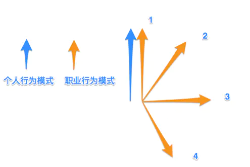
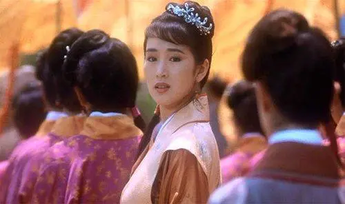
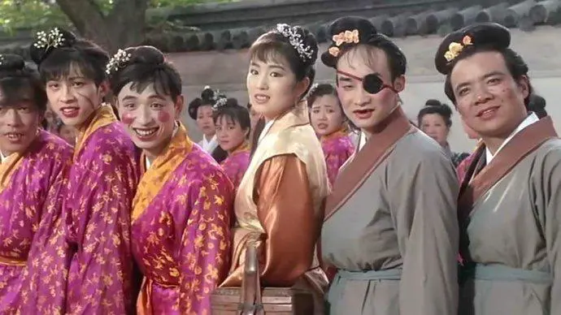

### FBI WARNING:

- 阅读本文前，建议先了解“幸存者偏差”；
- 行文过程并未考虑物质、家庭等因素，但这些也很重要；
- 彼之砒霜，吾之蜜糖。阅读后有帮助最好，没帮助笑笑就好~

### Part-1：为什么写这篇文章

假装谢邀。

不知不觉已工作两年半，HR 也做了一年。一想到 95 年的小姑娘已经毕业，连 00 后都快踏入大学，我这个 92 年的‘老男人’就不禁一阵悲伤。

至于为何写这篇文章，

- 其一，自身经历跟大部分同学类似。按部就班高考，上一所普通的大学，毕业后顺理成章工作。所以想法的参考性应该还不错；

- 其二，因为工作性质，了解了更多不同人的经历，很有趣~

- 其三，自己手贱，想到一些东西后不写不舒服斯基。

### Part-2 如何选择最适合自己的职业

先说结论：

```
if ( 没得选 ) {​
 唯一的选择就是最好的选择;​
} else {​
 选择工作性质和自己行为模式重合度最高的一个;​
} ​
```

选工作如同选伴侣。大家都期望自己的伴侣更漂亮，就如期望所从事职业更热门高薪一样。不过，

> “以色事人者，色衰而爱弛，爱弛则恩绝。”

因为美貌而爱上一个人，美貌消失爱也容易随之消逝；因为热门而选择职业，热门不再工作就倦了。

**还在各种培训班学设计、前端的同学；忘了前两年的 Android 和 iOS 了么？**
**抱歉说的很直白，但事实如此。如果让你不舒服了，你踏马用红包来打我呀~**

所以，面对“美貌”和“性格契合”的姑娘，如果只能选择一个....

一定选择胸大的那个！

好了说正经儿的：

**“美貌”的半衰期很短；而“性格”的半衰期对于人类几十年的寿命而言，足够长。理性人的选择很容易推断。**

选择一份短期内收入不错的工作，还是自己愿长期从事的工作，跟上面差不多；

**按照个人行为模式与职业行为模式的重合程度，初步分为 4 档。**  


####第一档：工作模式和行为模式近乎重合

最完美的模式。典型代表就是爱好即为职业的人。工作是因为做着开心，名声，报酬不过是顺带的收获。这里想到一个有趣的结论：员工和公司之间最好的关系——员工做的正是自己喜欢做的事情，公司恰好是这件事情的受益者。这种模式下，KPI 绩效之类的根本不用考虑了，因为根本没影响。

对一天工作的典型描述：

> “累成傻逼笑成狗”~

####第二档：工作模式和行为模式大方向一致

比较理想的状态。工作模式和个人行为模式有很多相似的地方。爱爬山的人往往不会排斥徒步；爱玩跳伞的人会也喜欢蹦极；爱玩 java 的同学，很少会排斥 python。因为比较类似。

典型场景：

> “矮油这个不错，试试看~”

####第三档：工作模式和行为模式基本不相关

工作归工作，生活归生活。 对工作不排斥，但也说不上喜欢。正常工作，按时下班，月底拿薪资，年底拿年终奖。其实这就是：

> “收人钱财与人消灾”

好像怪怪的... 嗯，应该说是

> "受人之托忠人之事"

还是这个好听些~

####第四档：工作模式和行为模式近乎相悖。

让一个看到代码就头大的人去做研发，让一个沉默寡言的人去做销售？还能再凶残一点？
极端一点、都知道的两个例子：李煜，朱由校（木匠皇帝）。

一句话：

> “上班的心情跟上坟一样沉重...”

少年，你在第几档？

### Part-3：识别自己喜欢或擅长的行为模式

选择适合自己的工作，先要识别自己的行为模式。
最简单的方式：从自己喜欢或擅长的，并有一定“产出”的事情中抽象出自己最真实的行为模式。
原则：**一切判定都需要用事实数据支持。**

- 游戏打的好？ 胜率？等级？自己努力打出来的还是刷出来的？
- 销售做的好？ 近两年业绩如何？跟周围同事的对比呢？跟过去一年的自己对比呢？
- 喜欢敲代码？ 工作之外自己敲了哪些东西？玩过哪些源码？翻过哪些文档? 只用框架你敢说喜欢技术？

过滤掉虚假的事实数据后，接下来不断问自己为什么。
还是用游戏举例（好像暴露了什么...）：

- 自己追求胜率还是寻求刺激？
- 自己谨守游戏规则还是想代练开挂等各种手段？
- 自己擅长哪些英雄？为什么？讨厌哪些英雄？为什么？
- 自己擅长打辅助还是输出还是把控全局的指挥官？为什么？
- 团队竞技还是个人竞技多？为什么？…

问的多了，自己喜欢或擅长的行为模式雏形就会浮现出。如果这些雏形能得到其他的事实数据支撑，可信度就更高。
如果你发现，自己在游戏中更喜欢“个人竞技”，喜欢的体育活动或工作中也是如此，那这点的可信度就比较高。

### Part-4 如何快速匹配适合自己的工作

**基础篇：多尝试，多比较**
若没有更好的办法，唯一的办法就是最好的方法。
实习或工作前期，多感受对比不同的公司和智能，让自己有个大致的想法。

“秋香美么？”


“一般般啦”

“现在呢？”



“哇！好美啊！”

这是最基础的做法，至少让你找到一份自己不排斥的工作。可能是因为老板很 nice，可能是因为公司福利很好，甚至只是因为公司距离家里比较进。 这些也重要，但并不是最关键的点。

**进阶篇：找到你想成为的人，直接跟他共事**
为何要这样做？

- 因为从成功经历中吸取经验远比从失败中吸取经验重要的多；
- 因为言传和身教是最直接、最有效的学习方式。

所以，寻找比你更强大，走的更远的同类人。学习他成功的经验、思维方式、曾踩过的坑。不要在意年龄，学历这些东西，学无长幼，先达者为师。

此外，从历史人物的经历中选取合适的道路也是可取的方法。虽然难度比较大，但总归是个方向。人类的历史那么长，从概率上讲，你想走的路，遇到的问题，自以为独特的奇思妙想，99.999999%以上有人经历过。 而能在历史上留下名字和故事的人，无疑是其中的佼佼者。

比如，想求不规则图形面积，放着现成的积分公式不用，非要自己去重新发明？是不是傻？是不是傻？？是不是傻？？？
杨绛那句著名的吐槽：“丫就是书读的太少，想得太多。” 其实一个意思。

类似例子太多，懒得举了...

**高级篇：直指内心：我想要什么**
若能做到:

- 尊重事实数据；
- 能‘输出’自己的独特想法；
- 对自己有客观而较为清晰的认知，已有自己的价值观基石。

基本可以直面自己的欲望而不会被反控，也不会被外面不同的、甚至冲突的思想迷惑。自己也能跳出“同类人”，并进入一个更大的圈子发现和学习。更有趣的是你会发现：

**想什么并不重要，重要的是如何想的？**

孟子说：生亦我所欲，义亦我所欲。 对他而言，’义‘是他最大的欲望。但没谁规定’义‘就是最大的，对个体而言“吃、喝、玩、乐、生产、破坏、责任....” 这些都有可能是他最重要的。

去掉他独特的观点，将生替代为 X，义替代为 Y 之后，看《鱼我所欲也》的正确读法：
鱼，我所欲也；熊掌，亦我所欲也。二者不可得兼，舍鱼而取熊掌者也。X，亦我所欲也；Y，亦我所欲也。二者不可得兼，舍 X 而取 Y 者也。"…….."非独贤者有是心也，人皆有之，贤者能勿丧耳。

而这样做好处是：**不认可你的思想，不妨碍学习你的强大。**

**更高级篇**
还没弄明白，热烈欢迎各路大神指点迷津~

### Part-5：后记

- 文章标题是最后起的，本来有些恶搞的意思。不过看完马克思的原文后发现，我想表达的里面基本都有，并且格局更大。坦率讲，有些丧气，因为终此一生可能也走不出前人的成就；也有些庆幸，确认了前面还有很多路能走，不会承受很多‘开荒的孤独’。建议大家阅读一下马克思的原文，很有趣~

- 纯理论、思辨类的书籍读起来的确无聊，像《战争论》《毛选》，也明白大家都喜欢听故事。所以推荐一下《明朝那些事儿》，一本故事性和反思性都很不错的书。第一次可以当故事书看，第二次可以重点关注作者的一些反思和求证，很有趣~

- 各路小伙伴儿有不同或更好的想法多来交流啊~

再强调一下：**想什么并不重要，重要的是怎么想**。
